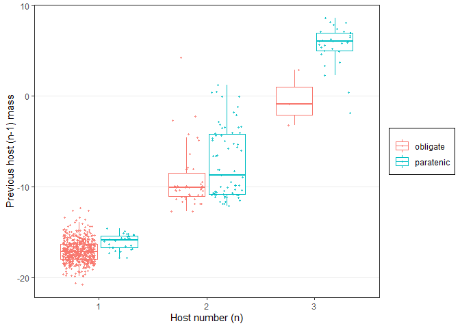
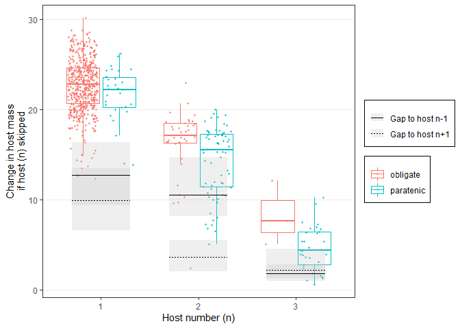

Eco bridges
================

  - [Exploration](#exploration)
      - [Body mass](#body-mass)
      - [Trophic level](#trophic-level)
  - [Conclusions](#conclusions)

First, we import the data table. It is at the level of parasite stages
and includes various host characteristics.

## Exploration

In a [previous notebook](paratenics_in_lcs.Rmd) we explored which hosts
were paratenic in life cycles. Now, let’s look at how paratenic hosts
may fill an ecological necessity for worms.

#### Body mass

First, we plot the correlation between hosts sizes (big current host,
big next host). Steps that involve obligate hosts are similar to those
that involve paratenic hosts. However, if the paratenic host is skipped,
then there is a large change in host size.

<!-- -->

Here is the same data but as a boxplot with groups separated by life
stage. Within a given life stage, paratenic and obligate links look
similar, but the change in host mass is larger when the paratenic host
is skipped.

<!-- -->
Maybe a slope graph is another way to look at the change? Each line
corresponds to a step in a species life cycle. The change in host mass
is consistently larger when the paratenic host is skipped, though the
difference tends to decrease in very long life cycles.

<!-- -->

Let’s fit mixed models for the change in host body mass. We add host
number, life cycle length, life stage, and then whether or not a link is
facultative.

Likelihood ratio tests show that adding host number is a large
improvement (changes in host mass decline with life cycle progression),
while adding life cycle length (the changes are smaller in longer life
cycles) and the interaction between stage and life cycle length is a
small improvement. Finally, it is clear that facultative step is a large
improvement.

|     | npar |      AIC |      BIC |     logLik | deviance |     Chisq | Df | Pr(\>Chisq) |
| :-- | ---: | -------: | -------: | ---------: | -------: | --------: | -: | ----------: |
| mm0 |    8 | 7883.624 | 7924.503 | \-3933.812 | 7867.624 |        NA | NA |          NA |
| mm1 |   11 | 7677.845 | 7734.054 | \-3827.923 | 7655.845 | 211.77814 |  3 |   0.0000000 |
| mm2 |   13 | 7665.330 | 7731.758 | \-3819.665 | 7639.330 |  16.51531 |  2 |   0.0002593 |
| mm3 |   16 | 7612.041 | 7693.799 | \-3790.021 | 7580.041 |  59.28884 |  3 |   0.0000000 |
| mm4 |   19 | 7359.320 | 7456.407 | \-3660.660 | 7321.320 | 258.72157 |  3 |   0.0000000 |

When we look at the parameters, we see that changes in host mass are
similar for obligate and paratenic links. But if the paratenic host is
skipped, then there is a large change in host mass.

    ## Linear mixed model fit by REML ['lmerMod']
    ## Formula: delta_host_bm ~ (1 | Parasite.species) + (1 | parasite_genus) +  
    ##     (1 | parasite_family) + (1 | parasite_order) + (1 | parasite_class) +  
    ##     (1 | parasite_phylum) + stage_lcl + fac_step
    ##    Data: filter(dat3, lcl_max_fac != "1")
    ## 
    ## REML criterion at convergence: 7313.2
    ## 
    ## Scaled residuals: 
    ##     Min      1Q  Median      3Q     Max 
    ## -2.7490 -0.6072 -0.0761  0.6527  3.3042 
    ## 
    ## Random effects:
    ##  Groups           Name        Variance  Std.Dev.
    ##  Parasite.species (Intercept)  0.000000 0.0000  
    ##  parasite_genus   (Intercept)  0.000000 0.0000  
    ##  parasite_family  (Intercept)  0.023892 0.1546  
    ##  parasite_order   (Intercept)  0.000000 0.0000  
    ##  parasite_class   (Intercept)  0.000000 0.0000  
    ##  parasite_phylum  (Intercept)  0.009644 0.0982  
    ##  Residual                     23.389024 4.8362  
    ## Number of obs: 1224, groups:  
    ## Parasite.species, 598; parasite_genus, 268; parasite_family, 90; parasite_order, 27; parasite_class, 6; parasite_phylum, 3
    ## 
    ## Fixed effects:
    ##                        Estimate Std. Error t value
    ## (Intercept)             14.1638     0.2828  50.084
    ## stage_lcllc2_2          -4.1830     0.3683 -11.359
    ## stage_lcllc3_1          -4.6368     0.6549  -7.081
    ## stage_lcllc3_2          -3.4014     0.7406  -4.593
    ## stage_lcllc3_3          -9.1020     0.5418 -16.800
    ## stage_lcllc3+_1         -6.0288     1.3321  -4.526
    ## stage_lcllc3+_2         -1.9981     1.1587  -1.724
    ## stage_lcllc3+_3        -11.2433     1.0422 -10.788
    ## stage_lcllc3+_4        -14.3864     0.7904 -18.201
    ## fac_stepto paratenic    -0.1776     0.6855  -0.259
    ## fac_stepfrom paratenic  -0.3749     0.5508  -0.681
    ## fac_stepskip paratenic   8.6343     0.5918  14.589
    ## 
    ## Correlation of Fixed Effects:
    ##             (Intr) st_2_2 st_3_1 st_3_2 st_3_3 s_3+_1 s_3+_2 s_3+_3 s_3+_4
    ## stg_lcll2_2 -0.718                                                        
    ## stg_lcll3_1 -0.398  0.304                                                 
    ## stg_lcll3_2 -0.267  0.224  0.153                                          
    ## stg_lcll3_3 -0.481  0.448  0.208  0.242                                   
    ## stg_lcl3+_1 -0.179  0.139  0.085  0.145  0.105                            
    ## stg_lcl3+_2 -0.214  0.182  0.098  0.142  0.200  0.061                     
    ## stg_lcl3+_3 -0.176  0.148  0.109  0.411  0.160  0.117  0.110              
    ## stg_lcl3+_4 -0.323  0.320  0.143  0.201  0.516  0.082  0.165  0.145       
    ## fc_stptprtn -0.142  0.090  0.000 -0.598 -0.023 -0.116 -0.078 -0.522 -0.060
    ## fc_stpfrmpr -0.019 -0.100  0.001 -0.141 -0.565 -0.015 -0.119 -0.093 -0.472
    ## fc_stpskppr -0.016 -0.099  0.001 -0.136 -0.488 -0.015 -0.122 -0.092 -0.479
    ##             fc_stptp fc_stpfp
    ## stg_lcll2_2                  
    ## stg_lcll3_1                  
    ## stg_lcll3_2                  
    ## stg_lcll3_3                  
    ## stg_lcl3+_1                  
    ## stg_lcl3+_2                  
    ## stg_lcl3+_3                  
    ## stg_lcl3+_4                  
    ## fc_stptprtn                  
    ## fc_stpfrmpr  0.135           
    ## fc_stpskppr  0.132    0.463  
    ## convergence code: 0
    ## boundary (singular) fit: see ?isSingular

#### Trophic level

We make the same plots for the change in host trophic level. We should
expect large “gaps” from one host to the next if the intermediate host
is skipped.

<!-- -->

Here is the same data but as a boxplot with groups separated by life
stage. Within a given life stage, paratenic and obligate links look
similar, but the change in host trophic level is larger when the
paratenic host is skipped.

<!-- -->
Maybe a slope graph is another way to look at the change? Each line
corresponds to a step in a species life cycle. The change in host
trophic level is consistently larger when the paratenic host is skipped,
though the difference tends to decrease in very long life cycles.

<!-- -->

Likelihood ratio tests show that adding host number is a large
improvement (changes in host TL decline with life cycle progression),
while adding life cycle length is not an improvement (the changes in TL
are consistent across life cycle lengths) and the interaction between
stage and life cycle length is a small improvement. Finally, it is clear
that facultative step is a large improvement.

|         | npar |      AIC |      BIC |      logLik | deviance |       Chisq | Df | Pr(\>Chisq) |
| :------ | ---: | -------: | -------: | ----------: | -------: | ----------: | -: | ----------: |
| mm0\_tl |    8 | 2539.303 | 2580.810 | \-1261.6515 | 2523.303 |          NA | NA |          NA |
| mm1\_tl |   11 | 2073.554 | 2130.627 | \-1025.7770 | 2051.554 | 471.7489179 |  3 |   0.0000000 |
| mm2\_tl |   13 | 2077.194 | 2144.644 | \-1025.5972 | 2051.194 |   0.3596578 |  2 |   0.8354132 |
| mm3\_tl |   16 | 2071.940 | 2154.955 | \-1019.9700 | 2039.940 |  11.2543421 |  3 |   0.0104271 |
| mm4\_tl |   19 | 1914.062 | 2012.641 |  \-938.0308 | 1876.062 | 163.8783817 |  3 |   0.0000000 |

When we look at the parameters, we see that changes in host TL are
similar for obligate and paratenic links. But if the paratenic host is
skipped, then there is a large change in host TL.

    ## Linear mixed model fit by REML ['lmerMod']
    ## Formula: delta_host_tl ~ (1 | Parasite.species) + (1 | parasite_genus) +  
    ##     (1 | parasite_family) + (1 | parasite_order) + (1 | parasite_class) +  
    ##     (1 | parasite_phylum) + stage_lcl + fac_step
    ##    Data: filter(dat3, lcl_max_fac != "1")
    ## 
    ## REML criterion at convergence: 1919.6
    ## 
    ## Scaled residuals: 
    ##     Min      1Q  Median      3Q     Max 
    ## -4.1259 -0.5850 -0.1140  0.6391  3.4339 
    ## 
    ## Random effects:
    ##  Groups           Name        Variance  Std.Dev. 
    ##  Parasite.species (Intercept) 0.000e+00 0.000e+00
    ##  parasite_genus   (Intercept) 7.628e-03 8.734e-02
    ##  parasite_family  (Intercept) 2.161e-02 1.470e-01
    ##  parasite_order   (Intercept) 5.190e-03 7.204e-02
    ##  parasite_class   (Intercept) 5.642e-10 2.375e-05
    ##  parasite_phylum  (Intercept) 2.523e-04 1.588e-02
    ##  Residual                     2.257e-01 4.751e-01
    ## Number of obs: 1324, groups:  
    ## Parasite.species, 633; parasite_genus, 282; parasite_family, 89; parasite_order, 26; parasite_class, 6; parasite_phylum, 3
    ## 
    ## Fixed effects:
    ##                        Estimate Std. Error t value
    ## (Intercept)             1.33165    0.04080  32.642
    ## stage_lcllc2_2         -0.61840    0.03388 -18.251
    ## stage_lcllc3_1         -0.08906    0.06213  -1.433
    ## stage_lcllc3_2         -0.54951    0.08554  -6.424
    ## stage_lcllc3_3         -0.76864    0.05874 -13.086
    ## stage_lcllc3+_1         0.19631    0.16536   1.187
    ## stage_lcllc3+_2        -0.51070    0.15472  -3.301
    ## stage_lcllc3+_3        -0.87252    0.12198  -7.153
    ## stage_lcllc3+_4        -1.65753    0.10156 -16.321
    ## fac_stepto paratenic   -0.04887    0.07748  -0.631
    ## fac_stepfrom paratenic -0.15625    0.06140  -2.545
    ## fac_stepskip paratenic  0.58104    0.06281   9.251
    ## 
    ## Correlation of Fixed Effects:
    ##             (Intr) st_2_2 st_3_1 st_3_2 st_3_3 s_3+_1 s_3+_2 s_3+_3 s_3+_4
    ## stg_lcll2_2 -0.409                                                        
    ## stg_lcll3_1 -0.300  0.259                                                 
    ## stg_lcll3_2 -0.183  0.149  0.205                                          
    ## stg_lcll3_3 -0.344  0.350  0.259  0.323                                   
    ## stg_lcl3+_1 -0.132  0.093  0.090  0.159  0.133                            
    ## stg_lcl3+_2 -0.144  0.121  0.097  0.156  0.222  0.176                     
    ## stg_lcl3+_3 -0.154  0.103  0.132  0.454  0.243  0.266  0.274              
    ## stg_lcl3+_4 -0.227  0.219  0.145  0.239  0.499  0.265  0.353  0.428       
    ## fc_stptprtn -0.057  0.074 -0.020 -0.674 -0.144 -0.134 -0.109 -0.533 -0.144
    ## fc_stpfrmpr  0.014 -0.090 -0.004 -0.227 -0.602 -0.054 -0.155 -0.181 -0.460
    ## fc_stpskppr  0.011 -0.098  0.002 -0.234 -0.533 -0.053 -0.167 -0.181 -0.456
    ##             fc_stptp fc_stpfp
    ## stg_lcll2_2                  
    ## stg_lcll3_1                  
    ## stg_lcll3_2                  
    ## stg_lcll3_3                  
    ## stg_lcl3+_1                  
    ## stg_lcl3+_2                  
    ## stg_lcl3+_3                  
    ## stg_lcl3+_4                  
    ## fc_stptprtn                  
    ## fc_stpfrmpr  0.258           
    ## fc_stpskppr  0.268    0.551  
    ## convergence code: 0
    ## boundary (singular) fit: see ?isSingular

# Conclusions

As expected, paratenic hosts fill an ecological vacuum in complex life
cycles.
