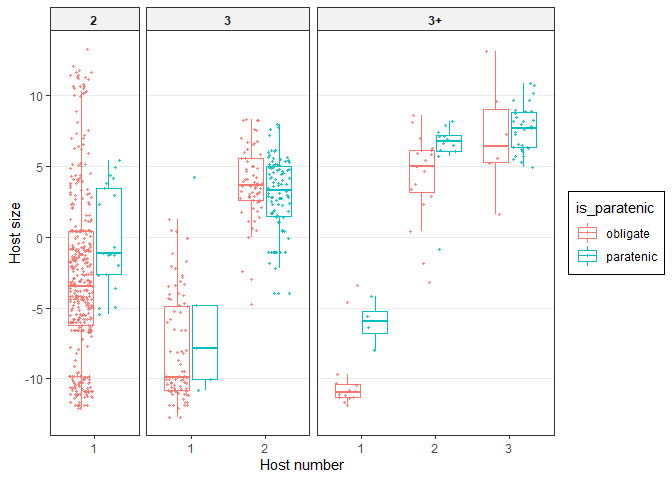

Paratenic hosts as ecological bridges
================

  - [Body mass](#body-mass)
      - [Previous host mass](#previous-host-mass)
      - [Next host mass](#next-host-mass)
      - [Gap when skipping hosts](#gap-when-skipping-hosts)
      - [Models - host mass](#models---host-mass)
  - [Trophic level](#trophic-level)
      - [Previous host trophic level](#previous-host-trophic-level)
      - [Next host trophic level](#next-host-trophic-level)
      - [Gap in trophic level when skipping
        hosts](#gap-in-trophic-level-when-skipping-hosts)
      - [Models - TL](#models---tl)
  - [Conclusions](#conclusions)
  - [Predator-prey mass ratios](#predator-prey-mass-ratios)

In another [notebook](paratenics_in_lcs.Rmd) we explored which hosts
were paratenic in life cycles. Now, let’s look at how paratenic hosts
may fill an ecological necessity for worms.

We start by making a figure demonstrating our hypothesis. Parasites with
complex life cycles infect multiple hosts in succession, and often they
are trophically transmitted - one host eats the next host. In some
cases, they can skip certain hosts in their life cycle. For example, a
parasite may be able to infect its third host with or without infecting
the second host beforehand; the second host is facultative. These
facultative hosts are usually paratenic hosts. In paratenic hosts,
parasites undergo little growth and development, so they are assumed to
not be *physiologically* necessary for life cycle completion. But are
they *ecologically* necessary? In other words, do they fill a smaller
trophic ‘gap’ than obligate hosts?

The demo figure shows how proxies of the hosts’ trophic niche, like body
mass or trophic level, increase with life cycle progression as parasites
ascend the trophic chain. If an intermediate host is facultative (red
point), we would expect it to bridge a smaller ecological gap between
hosts. Specifically, the previous host should be relatively large (1) or
the next host should be relatively small (2). Thus, if this host were
skipped, the ecological “jump” a parasite needs to make is smaller (3,
dashed vs solid line).

<!-- -->

Is this the pattern we see in real parasite life cycles? We import the
data table. It is at the level of parasite stages and includes various
host characteristics.

We wrangle the data so that for every step in the life cycle we also
have the previous and next host size/trophic level. For the first host,
the previous host size is the propagule size, and for previous host
trophic level, it is 1 (primary producer/detritus).

# Body mass

We can start by looking at host body mass as our proxy for ecological
niche. First, we simply plot host body mass across life cycle stages. We
only plot intermediate hosts, since we are interested in when hosts are
paratenic vs obligate intermediate hosts. At most stages, paratenic
hosts do not seem to be larger than obligate hosts, though perhaps
paratenic first hosts are larger than obligate first hosts.

<!-- -->

### Previous host mass

What about the host before the paratenic host? We first plot this in
general (not separated by life cycle length). The hosts before a
paratenic host tend to be larger than the hosts before an obligate
intermediate host. This is consistent with our toy figure, pattern (1).

<!-- -->

We know that size changes from one host to the next are not the same
across life stages (e.g. predator-prey mass ratios get smaller with
size). Therefore, let’s break this apart by life cycle length. At any
given life stage, the host before a paratenic host tends to be larger.

<!-- -->
This pattern is not quite as clear once we control for parasite phylum.

<!-- -->

So, the host preceding a paratenic host tend to be larger than those
preceding an obligate host, but this may not be super consistent across
phyla. What about the host after a paratenic host?

### Next host mass

The host after a paratenic host looks to be the same size as the host
after an obligate intermediate host. This is not consistent with pattern
2 in the demo figure.

<!-- -->

When we break this down by life cycle length, the pattern does not
change. Paratenics transmit worms to next hosts that are about the same
size when transmitted via obligate hosts.

<!-- -->
Once we control for parasite phylum, there might be a slight decrease in
some stages, but the trend is not obvious.

<!-- -->

So if the host before a paratenic is larger, while the host after is the
same size, then the ‘gap’ bridged by paratenic hosts should be smaller
than the gap bridged by obligate intermediate hosts.

### Gap when skipping hosts

When we plot gap size when skipping an intermediate host (e.g. egg to
second host, first to third host, and second to fourth host), we see
that it is smaller when the paratenic host is skipped, especially at
later life stages. This makes sense: paratenics are probably more common
in later life stages, because they fill smaller “gaps”. However, just
because paratenics fill a smaller ‘gap’ does not mean that they are not
ecologically helpful. We can see this by comparing the gap when skipping
intermediate hosts with the gaps when infecting them. The dashed and
solid black lines show these gaps (plus IQR) - the gaps are consistently
smaller than when a host is skipped. Only in later stages does skipping
paratenics compare to not skipping any hosts (they probably are
ecologically disposable at these later stages).

<!-- -->

Here is the same plot, but separated by life cycle stage.

<!-- -->

When we separate by phylum, it is less obvious that ‘gaps’ are smaller
for paratenic hosts.

<!-- -->

Perhaps another way to plot this is with a slope graph. Each line is one
parasite species. It looks like transmission via paratenic stages (blue
lines) may be a little flatter than red lines (transmission via obligate
hosts). But in general the patterns are not easy to see…

<!-- -->

So from visual inspection, paratenic stages are associated with bigger
previous hosts, same-sized next hosts, and thus smaller gaps when
skipping paratenic hosts. However, these gaps are still larger than if
the host were not skipped, suggesting paratenic hosts are ecologically
beneficial, but less so than obligate hosts.

### Models - host mass

Let’s fit mixed models to test these patterns. First, we will simply
compare paratenic and obligate host size.

#### Size of paratenic vs obligate intermediate hosts

We fit the following models adding these terms in series: 0) int-only,
1) host in cycle, 2) paratenic vs obligate, 3) host and paratenic
interaction.

The likelihood ratio tests suggest that second hosts are bigger than
first hosts, etc. But the addition of the paratenic vs obligate
distinction is marginally significant and the interaction with host
stage not at all. Thus, at a given stage, paratenic hosts do not differ
in size from obligate hosts.

|           | npar |      AIC |      BIC |     logLik | deviance |      Chisq | Df | Pr(\>Chisq) |
| :-------- | ---: | -------: | -------: | ---------: | -------: | ---------: | -: | ----------: |
| mm0\_bm   |    8 | 4561.837 | 4598.722 | \-2272.918 | 4545.837 |         NA | NA |          NA |
| mm1\_bm   |   10 | 3794.060 | 3840.167 | \-1887.030 | 3774.060 | 771.776407 |  2 |   0.0000000 |
| mm1.1\_bm |   11 | 3792.933 | 3843.651 | \-1885.466 | 3770.933 |   3.127453 |  1 |   0.0769839 |
| mm1.2\_bm |   13 | 3794.548 | 3854.488 | \-1884.274 | 3768.548 |   2.384450 |  2 |   0.3035451 |

When we fit the same series of models, but use life stage (host number x
life cycle length) instead of just host number, the results are similar.
Paratenic hosts at a given stage are not obviously smaller/larger than
obligate hosts.

|           | npar |      AIC |      BIC |     logLik | deviance |      Chisq | Df | Pr(\>Chisq) |
| :-------- | ---: | -------: | -------: | ---------: | -------: | ---------: | -: | ----------: |
| mm1\_bm   |   10 | 3794.060 | 3840.167 | \-1887.030 | 3774.060 |         NA | NA |          NA |
| mm2\_bm   |   13 | 3724.705 | 3784.644 | \-1849.353 | 3698.705 | 75.3550399 |  3 |   0.0000000 |
| mm2.1\_bm |   14 | 3726.652 | 3791.202 | \-1849.326 | 3698.652 |  0.0534471 |  1 |   0.8171701 |
| mm2.2\_bm |   19 | 3726.665 | 3814.268 | \-1844.333 | 3688.665 |  9.9868447 |  5 |   0.0756089 |

#### Previous host mass

Let’s fit the same models to our other response variables, starting with
previous host mass.

Adding “paratenic” to a model with just host number is an improvement as
is the interaction between host number and “paratenic”.

|            | npar |      AIC |      BIC |     logLik | deviance |      Chisq | Df | Pr(\>Chisq) |
| :--------- | ---: | -------: | -------: | ---------: | -------: | ---------: | -: | ----------: |
| mm0\_bmp   |    8 | 4604.671 | 4641.863 | \-2294.336 | 4588.671 |         NA | NA |          NA |
| mm1\_bmp   |   10 | 3076.933 | 3123.423 | \-1528.466 | 3056.933 | 1531.73818 |  2 |     0.0e+00 |
| mm1.1\_bmp |   11 | 3056.935 | 3108.074 | \-1517.468 | 3034.935 |   21.99767 |  1 |     2.7e-06 |
| mm1.2\_bmp |   13 | 3019.132 | 3079.569 | \-1496.566 | 2993.132 |   41.80286 |  2 |     0.0e+00 |

This is because previous host size tends to be larger for paratenic
stages, particularly in later hosts.

    ## Linear mixed model fit by REML ['lmerMod']
    ## Formula: host_bm_prev ~ (1 | Parasite.species) + (1 | parasite_genus) +  
    ##     (1 | parasite_family) + (1 | parasite_order) + (1 | parasite_class) +  
    ##     (1 | parasite_phylum) + Host_no_fac + is_paratenic + Host_no_fac:is_paratenic
    ##    Data: filter(dat2, lcl_max_fac != "1", Def.int != "Definitive")
    ## 
    ## REML criterion at convergence: 2994.5
    ## 
    ## Scaled residuals: 
    ##     Min      1Q  Median      3Q     Max 
    ## -4.1061 -0.4394 -0.0871  0.3277  6.9297 
    ## 
    ## Random effects:
    ##  Groups           Name        Variance Std.Dev.
    ##  Parasite.species (Intercept) 0.00000  0.0000  
    ##  parasite_genus   (Intercept) 0.07957  0.2821  
    ##  parasite_family  (Intercept) 0.26697  0.5167  
    ##  parasite_order   (Intercept) 0.54388  0.7375  
    ##  parasite_class   (Intercept) 0.00000  0.0000  
    ##  parasite_phylum  (Intercept) 0.14908  0.3861  
    ##  Residual                     2.52330  1.5885  
    ## Number of obs: 772, groups:  
    ## Parasite.species, 671; parasite_genus, 299; parasite_family, 95; parasite_order, 30; parasite_class, 6; parasite_phylum, 3
    ## 
    ## Fixed effects:
    ##                                    Estimate Std. Error t value
    ## (Intercept)                        -16.9545     0.3038 -55.805
    ## Host_no_fac2                         7.8369     0.2979  26.303
    ## Host_no_fac3                        15.8513     0.9701  16.340
    ## is_paratenicparatenic               -0.2250     0.3542  -0.635
    ## Host_no_fac2:is_paratenicparatenic   1.9951     0.5189   3.845
    ## Host_no_fac3:is_paratenicparatenic   6.6350     1.0749   6.173
    ## 
    ## Correlation of Fixed Effects:
    ##             (Intr) Hst__2 Hst__3 is_prt H__2:_
    ## Host_no_fc2 -0.089                            
    ## Host_no_fc3 -0.029  0.094                     
    ## is_prtncprt -0.067  0.136  0.085              
    ## Hst_n_fc2:_  0.070 -0.630 -0.097 -0.735       
    ## Hst_n_fc3:_  0.027 -0.038 -0.896 -0.352  0.252
    ## convergence code: 0
    ## boundary (singular) fit: see ?isSingular

Adding life cycle stage does not explain much variation, beyond host
number alone, but adding the paratenic vs obligate distinction does.

|            | npar |      AIC |      BIC |     logLik | deviance |    Chisq | Df | Pr(\>Chisq) |
| :--------- | ---: | -------: | -------: | ---------: | -------: | -------: | -: | ----------: |
| mm1\_bmp   |   10 | 3076.933 | 3123.423 | \-1528.466 | 3056.933 |       NA | NA |          NA |
| mm2\_bmp   |   13 | 3076.379 | 3136.816 | \-1525.190 | 3050.379 |  6.55382 |  3 |   0.0875640 |
| mm2.1\_bmp |   14 | 3060.011 | 3125.097 | \-1516.005 | 3032.011 | 18.36836 |  1 |   0.0000182 |
| mm2.2\_bmp |   19 | 3027.433 | 3115.763 | \-1494.716 | 2989.433 | 42.57796 |  5 |   0.0000000 |

Here are the parameters. The parameters for “paratenic” are generally
positive, indicating previous host mass is larger for paratenic hosts
than obligate intermediate hosts.

    ## Linear mixed model fit by REML ['lmerMod']
    ## Formula: host_bm_prev ~ (1 | Parasite.species) + (1 | parasite_genus) +  
    ##     (1 | parasite_family) + (1 | parasite_order) + (1 | parasite_class) +  
    ##     (1 | parasite_phylum) + stage_lcl + is_paratenic + stage_lcl:is_paratenic
    ##    Data: filter(dat2, lcl_max_fac != "1", Def.int != "Definitive")
    ## 
    ## REML criterion at convergence: 2986.6
    ## 
    ## Scaled residuals: 
    ##     Min      1Q  Median      3Q     Max 
    ## -4.0816 -0.4279 -0.0755  0.3271  6.7973 
    ## 
    ## Random effects:
    ##  Groups           Name        Variance Std.Dev.
    ##  Parasite.species (Intercept) 0.00000  0.0000  
    ##  parasite_genus   (Intercept) 0.07807  0.2794  
    ##  parasite_family  (Intercept) 0.25996  0.5099  
    ##  parasite_order   (Intercept) 0.54715  0.7397  
    ##  parasite_class   (Intercept) 0.00000  0.0000  
    ##  parasite_phylum  (Intercept) 0.15778  0.3972  
    ##  Residual                     2.53468  1.5921  
    ## Number of obs: 772, groups:  
    ## Parasite.species, 671; parasite_genus, 299; parasite_family, 95; parasite_order, 30; parasite_class, 6; parasite_phylum, 3
    ## 
    ## Fixed effects:
    ##                                        Estimate Std. Error t value
    ## (Intercept)                           -16.99707    0.31356 -54.207
    ## stage_lcllc3_1                          0.22571    0.18307   1.233
    ## stage_lcllc3_2                          7.95154    0.36435  21.824
    ## stage_lcllc3+_1                        -0.36277    0.48366  -0.750
    ## stage_lcllc3+_2                         7.58462    0.49333  15.374
    ## stage_lcllc3+_3                        15.82600    0.98040  16.142
    ## is_paratenicparatenic                   0.02589    0.44132   0.059
    ## stage_lcllc3_1:is_paratenicparatenic   -0.98042    0.79746  -1.229
    ## stage_lcllc3_2:is_paratenicparatenic    1.68277    0.61431   2.739
    ## stage_lcllc3+_1:is_paratenicparatenic   0.01398    1.02781   0.014
    ## stage_lcllc3+_2:is_paratenicparatenic   2.12888    1.11838   1.904
    ## stage_lcllc3+_3:is_paratenicparatenic   6.34165    1.10616   5.733
    ## 
    ## Correlation of Fixed Effects:
    ##             (Intr) st_3_1 st_3_2 st_3+_1 st_3+_2 st_3+_3 is_prt s_3_1: s_3_2:
    ## stg_lcll3_1 -0.159                                                           
    ## stg_lcll3_2 -0.116  0.183                                                    
    ## stg_lcl3+_1 -0.094  0.149  0.198                                             
    ## stg_lcl3+_2 -0.089  0.142  0.195  0.276                                      
    ## stg_lcl3+_3 -0.045  0.062  0.111  0.091   0.088                              
    ## is_prtncprt -0.066  0.071  0.085  0.049   0.054   0.046                      
    ## stg_lc3_1:_  0.037 -0.225  0.006 -0.005   0.001   0.023  -0.507              
    ## stg_lc3_2:_  0.078 -0.063 -0.610 -0.119  -0.121  -0.083  -0.749  0.339       
    ## stg_l3+_1:_  0.032 -0.047 -0.045 -0.407  -0.048   0.016  -0.408  0.245  0.310
    ## stg_l3+_2:_  0.032 -0.038 -0.050 -0.054  -0.363   0.010  -0.379  0.220  0.293
    ## stg_l3+_3:_  0.029 -0.027 -0.047  0.008   0.021  -0.855  -0.409  0.191  0.313
    ##             s_3+_1: s_3+_2:
    ## stg_lcll3_1                
    ## stg_lcll3_2                
    ## stg_lcl3+_1                
    ## stg_lcl3+_2                
    ## stg_lcl3+_3                
    ## is_prtncprt                
    ## stg_lc3_1:_                
    ## stg_lc3_2:_                
    ## stg_l3+_1:_                
    ## stg_l3+_2:_  0.189         
    ## stg_l3+_3:_  0.144   0.131 
    ## convergence code: 0
    ## boundary (singular) fit: see ?isSingular

Looking at the random effects, they were relatively large for parasite
phylum, possibly indicating that some differences were driven by
taxonomy. Therefore, to check for consistency let’s fit the same models
for just nematodes and cestodes (acanths have too little variation).

The trends are still significant in nematodes when we only compare
across host number…

|                 | npar |      AIC |      BIC |      logLik | deviance |     Chisq | Df | Pr(\>Chisq) |
| :-------------- | ---: | -------: | -------: | ----------: | -------: | --------: | -: | ----------: |
| mm0\_bmp\_nem   |    7 | 2461.601 | 2489.399 | \-1223.8003 | 2447.601 |        NA | NA |          NA |
| mm1\_bmp\_nem   |    9 | 1604.942 | 1640.683 |  \-793.4710 | 1586.942 | 860.65849 |  2 |   0.0000000 |
| mm1.1\_bmp\_nem |   10 | 1596.246 | 1635.959 |  \-788.1231 | 1576.246 |  10.69587 |  1 |   0.0010738 |
| mm1.2\_bmp\_nem |   12 | 1561.141 | 1608.796 |  \-768.5704 | 1537.141 |  39.10543 |  2 |   0.0000000 |

…as well as when we compare across life cycle stage.

|                 | npar |      AIC |      BIC |     logLik | deviance |     Chisq | Df | Pr(\>Chisq) |
| :-------------- | ---: | -------: | -------: | ---------: | -------: | --------: | -: | ----------: |
| mm1\_bmp\_nem   |    9 | 1604.942 | 1640.683 | \-793.4710 | 1586.942 |        NA | NA |          NA |
| mm2\_bmp\_nem   |   12 | 1599.606 | 1647.261 | \-787.8031 | 1575.606 | 11.335973 |  3 |   0.0100412 |
| mm2.1\_bmp\_nem |   13 | 1595.886 | 1647.512 | \-784.9430 | 1569.886 |  5.720052 |  1 |   0.0167722 |
| mm2.2\_bmp\_nem |   18 | 1566.344 | 1637.827 | \-765.1720 | 1530.344 | 39.542047 |  5 |   0.0000002 |

By contrast, in cestodes, there is not a main effect of “paratenic” but
there is an interaction. Specifically, hosts before paratenics are
smaller at late life stages but not earlier ones (not shown).

|                 | npar |       AIC |       BIC |     logLik |  deviance |       Chisq | Df | Pr(\>Chisq) |
| :-------------- | ---: | --------: | --------: | ---------: | --------: | ----------: | -: | ----------: |
| mm0\_bmp\_ces   |    6 | 1586.7842 | 1608.7619 | \-787.3921 | 1574.7842 |          NA | NA |          NA |
| mm1\_bmp\_ces   |    8 |  946.2122 |  975.5159 | \-465.1061 |  930.2122 | 644.5719783 |  2 |   0.0000000 |
| mm1.1\_bmp\_ces |    9 |  948.0381 |  981.0048 | \-465.0191 |  930.0381 |   0.1740897 |  1 |   0.6765025 |
| mm1.2\_bmp\_ces |   11 |  941.9561 |  982.2487 | \-459.9780 |  919.9561 |  10.0820234 |  2 |   0.0064672 |

We get the same result when we break it down further by life cycle
stages.

|                 | npar |      AIC |      BIC |     logLik | deviance |      Chisq | Df | Pr(\>Chisq) |
| :-------------- | ---: | -------: | -------: | ---------: | -------: | ---------: | -: | ----------: |
| mm1\_bmp\_ces   |    8 | 946.2122 | 975.5159 | \-465.1061 | 930.2122 |         NA | NA |          NA |
| mm2\_bmp\_ces   |   11 | 941.3610 | 981.6536 | \-459.6805 | 919.3610 | 10.8511712 |  3 |   0.0125585 |
| mm2.1\_bmp\_ces |   12 | 943.3605 | 987.3160 | \-459.6802 | 919.3605 |  0.0005321 |  1 |   0.9815967 |
| mm2.2\_bmp\_ces |   14 | 938.1590 | 989.4405 | \-455.0795 | 910.1590 |  9.2014719 |  2 |   0.0100444 |

#### Next host mass

Moving on to our next response variable, next host mass. Are the hosts
after paratenics smaller than expected? We fit the same models again.

Distinguishing paratenic and obligate stages does not explain variation
beyond that accounted for by host number.

|            | npar |      AIC |      BIC |     logLik | deviance |      Chisq | Df | Pr(\>Chisq) |
| :--------- | ---: | -------: | -------: | ---------: | -------: | ---------: | -: | ----------: |
| mm0\_bmn   |    8 | 4942.143 | 4981.703 | \-2463.072 | 4926.143 |         NA | NA |          NA |
| mm1\_bmn   |   10 | 4679.820 | 4729.271 | \-2329.910 | 4659.820 | 266.322620 |  2 |   0.0000000 |
| mm1.1\_bmn |   11 | 4679.033 | 4733.428 | \-2328.516 | 4657.033 |   2.787887 |  1 |   0.0949794 |
| mm1.2\_bmn |   13 | 4681.861 | 4746.147 | \-2327.931 | 4655.861 |   1.171038 |  2 |   0.5568167 |

The parameters indicate that next host size is about the same,
regardless of whether the intermediate host is a paratenic or obligate
host.

    ## Linear mixed model fit by REML ['lmerMod']
    ## Formula: host_bm_next ~ (1 | Parasite.species) + (1 | parasite_genus) +  
    ##     (1 | parasite_family) + (1 | parasite_order) + (1 | parasite_class) +  
    ##     (1 | parasite_phylum) + Host_no_fac + is_paratenic + Host_no_fac:is_paratenic
    ##    Data: filter(dat2, lcl_max_fac != "1", Def.int != "Definitive")
    ## 
    ## REML criterion at convergence: 4657.3
    ## 
    ## Scaled residuals: 
    ##     Min      1Q  Median      3Q     Max 
    ## -4.6728 -0.4766  0.0482  0.5194  4.0902 
    ## 
    ## Random effects:
    ##  Groups           Name        Variance Std.Dev.
    ##  Parasite.species (Intercept) 0.46182  0.6796  
    ##  parasite_genus   (Intercept) 1.73626  1.3177  
    ##  parasite_family  (Intercept) 1.26841  1.1262  
    ##  parasite_order   (Intercept) 0.46733  0.6836  
    ##  parasite_class   (Intercept) 0.00000  0.0000  
    ##  parasite_phylum  (Intercept) 0.07618  0.2760  
    ##  Residual                     3.37412  1.8369  
    ## Number of obs: 1038, groups:  
    ## Parasite.species, 813; parasite_genus, 341; parasite_family, 102; parasite_order, 30; parasite_class, 6; parasite_phylum, 3
    ## 
    ## Fixed effects:
    ##                                    Estimate Std. Error t value
    ## (Intercept)                          5.6495     0.3001  18.824
    ## Host_no_fac2                         2.9540     0.2607  11.331
    ## Host_no_fac3                         4.7211     0.8851   5.334
    ## is_paratenicparatenic               -0.6711     0.4264  -1.574
    ## Host_no_fac2:is_paratenicparatenic   0.3544     0.5625   0.630
    ## Host_no_fac3:is_paratenicparatenic   1.1296     1.0480   1.078
    ## 
    ## Correlation of Fixed Effects:
    ##             (Intr) Hst__2 Hst__3 is_prt H__2:_
    ## Host_no_fc2 -0.107                            
    ## Host_no_fc3 -0.048  0.155                     
    ## is_prtncprt -0.089  0.168  0.097              
    ## Hst_n_fc2:_  0.089 -0.570 -0.134 -0.818       
    ## Hst_n_fc3:_  0.058 -0.113 -0.848 -0.447  0.388
    ## convergence code: 0
    ## boundary (singular) fit: see ?isSingular

Adding life cycle length is an improvement over just host number (next
hosts are smaller in longer cycles), but there is still not much
variation explained by distinguishing paratenic vs obligate intermediate
hosts. There was a marginal interaction with stage.

|            | npar |      AIC |      BIC |     logLik | deviance |       Chisq | Df | Pr(\>Chisq) |
| :--------- | ---: | -------: | -------: | ---------: | -------: | ----------: | -: | ----------: |
| mm1\_bmn   |   10 | 4679.820 | 4729.271 | \-2329.910 | 4659.820 |          NA | NA |          NA |
| mm2\_bmn   |   13 | 4462.031 | 4526.317 | \-2218.015 | 4436.031 | 223.7895444 |  3 |   0.0000000 |
| mm2.1\_bmn |   14 | 4463.705 | 4532.936 | \-2217.852 | 4435.705 |   0.3260141 |  1 |   0.5680156 |
| mm2.2\_bmn |   19 | 4461.681 | 4555.637 | \-2211.841 | 4423.681 |  12.0237085 |  5 |   0.0344644 |

However, the parameters suggest that the hosts after paratenics are
sometimes larger and sometimes smaller - there is not a clear trend in
the expected direction (smaller next hosts).

    ## Linear mixed model fit by REML ['lmerMod']
    ## Formula: host_bm_next ~ (1 | Parasite.species) + (1 | parasite_genus) +  
    ##     (1 | parasite_family) + (1 | parasite_order) + (1 | parasite_class) +  
    ##     (1 | parasite_phylum) + stage_lcl + is_paratenic + stage_lcl:is_paratenic
    ##    Data: filter(dat2, lcl_max_fac != "1", Def.int != "Definitive")
    ## 
    ## REML criterion at convergence: 4421.6
    ## 
    ## Scaled residuals: 
    ##     Min      1Q  Median      3Q     Max 
    ## -4.8529 -0.5123  0.0043  0.5155  3.9716 
    ## 
    ## Random effects:
    ##  Groups           Name        Variance Std.Dev.
    ##  Parasite.species (Intercept) 0.2350   0.4847  
    ##  parasite_genus   (Intercept) 1.6539   1.2860  
    ##  parasite_family  (Intercept) 0.9034   0.9505  
    ##  parasite_order   (Intercept) 0.5237   0.7237  
    ##  parasite_class   (Intercept) 0.0000   0.0000  
    ##  parasite_phylum  (Intercept) 0.4598   0.6781  
    ##  Residual                     2.7421   1.6559  
    ## Number of obs: 1038, groups:  
    ## Parasite.species, 813; parasite_genus, 341; parasite_family, 102; parasite_order, 30; parasite_class, 6; parasite_phylum, 3
    ## 
    ## Fixed effects:
    ##                                       Estimate Std. Error t value
    ## (Intercept)                             6.5103     0.4680  13.912
    ## stage_lcllc3_1                         -3.3276     0.2101 -15.841
    ## stage_lcllc3_2                          0.8077     0.3010   2.684
    ## stage_lcllc3+_1                        -1.7984     0.5556  -3.237
    ## stage_lcllc3+_2                         0.5146     0.5335   0.964
    ## stage_lcllc3+_3                         2.5032     0.8452   2.961
    ## is_paratenicparatenic                  -0.5102     0.5360  -0.952
    ## stage_lcllc3_1:is_paratenicparatenic    1.4694     0.8759   1.678
    ## stage_lcllc3_2:is_paratenicparatenic    0.7069     0.6333   1.116
    ## stage_lcllc3+_1:is_paratenicparatenic  -1.6209     0.9964  -1.627
    ## stage_lcllc3+_2:is_paratenicparatenic  -0.3847     0.8743  -0.440
    ## stage_lcllc3+_3:is_paratenicparatenic   0.9373     1.0116   0.927
    ## 
    ## Correlation of Fixed Effects:
    ##             (Intr) st_3_1 st_3_2 st_3+_1 st_3+_2 st_3+_3 is_prt s_3_1: s_3_2:
    ## stg_lcll3_1 -0.127                                                           
    ## stg_lcll3_2 -0.108  0.455                                                    
    ## stg_lcl3+_1 -0.068  0.219  0.249                                             
    ## stg_lcl3+_2 -0.073  0.234  0.275  0.551                                      
    ## stg_lcl3+_3 -0.050  0.139  0.175  0.263   0.327                              
    ## is_prtncprt -0.056  0.071  0.060  0.046   0.047   0.035                      
    ## stg_lc3_1:_  0.036 -0.198 -0.002  0.003   0.006   0.014  -0.593              
    ## stg_lc3_2:_  0.063 -0.105 -0.441 -0.110  -0.121  -0.084  -0.853  0.466       
    ## stg_l3+_1:_  0.031 -0.034 -0.019 -0.364  -0.078   0.006  -0.534  0.336  0.448
    ## stg_l3+_2:_  0.037 -0.053 -0.052  0.059  -0.329  -0.052  -0.609  0.368  0.527
    ## stg_l3+_3:_  0.035 -0.033 -0.039  0.087   0.000  -0.708  -0.534  0.305  0.460
    ##             s_3+_1: s_3+_2:
    ## stg_lcll3_1                
    ## stg_lcll3_2                
    ## stg_lcl3+_1                
    ## stg_lcl3+_2                
    ## stg_lcl3+_3                
    ## is_prtncprt                
    ## stg_lc3_1:_                
    ## stg_lc3_2:_                
    ## stg_l3+_1:_                
    ## stg_l3+_2:_  0.265         
    ## stg_l3+_3:_  0.211   0.384 
    ## convergence code: 0
    ## boundary (singular) fit: see ?isSingular

Again, the phylum-level effects were relatively large, so we fit the
same models for just nematodes and cestodes.

In nematodes, there was marginally significant main effect for
‘paratenic’. It was also in the expected direction (smaller next hosts
after a paratenic).

|                 | npar |      AIC |      BIC |     logLik | deviance |      Chisq | Df | Pr(\>Chisq) |
| :-------------- | ---: | -------: | -------: | ---------: | -------: | ---------: | -: | ----------: |
| mm0\_bmn\_nem   |    7 | 2263.201 | 2292.403 | \-1124.600 | 2249.201 |         NA | NA |          NA |
| mm1\_bmn\_nem   |    9 | 2122.104 | 2159.649 | \-1052.052 | 2104.104 | 145.096673 |  2 |   0.0000000 |
| mm1.1\_bmn\_nem |   10 | 2119.034 | 2160.751 | \-1049.517 | 2099.034 |   5.069842 |  1 |   0.0243456 |
| mm1.2\_bmn\_nem |   12 | 2121.183 | 2171.244 | \-1048.592 | 2097.183 |   1.851192 |  2 |   0.3962951 |

However, when we control for life cycle length, this pattern weakens and
is not significant.

|                 | npar |      AIC |      BIC |     logLik | deviance |     Chisq | Df | Pr(\>Chisq) |
| :-------------- | ---: | -------: | -------: | ---------: | -------: | --------: | -: | ----------: |
| mm1\_bmn\_nem   |    9 | 2122.104 | 2159.649 | \-1052.052 | 2104.104 |        NA | NA |          NA |
| mm2\_bmn\_nem   |   12 | 2050.606 | 2100.666 | \-1013.303 | 2026.606 | 77.498340 |  3 |   0.0000000 |
| mm2.1\_bmn\_nem |   13 | 2050.621 | 2104.853 | \-1012.310 | 2024.621 |  1.985076 |  1 |   0.1588567 |
| mm2.2\_bmn\_nem |   18 | 2053.226 | 2128.316 | \-1008.613 | 2017.226 |  7.395145 |  5 |   0.1928720 |

In cestodes, there was no trend for next hosts to be smaller after a
“paratenic”, when only considering host number.

|                 | npar |      AIC |      BIC |     logLik | deviance |     Chisq | Df | Pr(\>Chisq) |
| :-------------- | ---: | -------: | -------: | ---------: | -------: | --------: | -: | ----------: |
| mm0\_bmn\_ces   |    6 | 2108.195 | 2132.674 | \-1048.097 | 2096.195 |        NA | NA |          NA |
| mm1\_bmn\_ces   |    8 | 2021.532 | 2054.172 | \-1002.766 | 2005.532 | 90.662433 |  2 |   0.0000000 |
| mm1.1\_bmn\_ces |    9 | 2022.514 | 2059.233 | \-1002.257 | 2004.514 |  1.018325 |  1 |   0.3129166 |
| mm1.2\_bmn\_ces |   11 | 2022.579 | 2067.458 | \-1000.290 | 2000.579 |  3.934995 |  2 |   0.1398063 |

When we break it down further by life cycle stages, there is a marginal
effect, but it is in the opposite direction than predicted (parameters
not printed).

|                 | npar |      AIC |      BIC |      logLik | deviance |      Chisq | Df | Pr(\>Chisq) |
| :-------------- | ---: | -------: | -------: | ----------: | -------: | ---------: | -: | ----------: |
| mm1\_bmn\_ces   |    8 | 2021.532 | 2054.172 | \-1002.7662 | 2005.532 |         NA | NA |          NA |
| mm2\_bmn\_ces   |   11 | 1889.622 | 1934.501 |  \-933.8109 | 1867.622 | 137.910544 |  3 |   0.0000000 |
| mm2.1\_bmn\_ces |   12 | 1887.770 | 1936.729 |  \-931.8851 | 1863.770 |   3.851694 |  1 |   0.0496958 |
| mm2.2\_bmn\_ces |   14 | 1885.361 | 1942.480 |  \-928.6806 | 1857.361 |   6.408955 |  2 |   0.0405801 |

These models suggest that there is not a consistent trend, across life
stage and taxa, for smaller hosts to come after paratenic hosts.

#### Change in mass when skipping intermediate hosts

Finally, we consider the “gap” - how big is the difference between hosts
if an intermediate host is skipped?

Fitting the same series of models, we find that distinguishing paratenic
and obligate hosts is a moderate improvement, mainly for the main
effect.

|            | npar |      AIC |      BIC |     logLik | deviance |     Chisq | Df | Pr(\>Chisq) |
| :--------- | ---: | -------: | -------: | ---------: | -------: | --------: | -: | ----------: |
| mm1\_bms   |   10 | 3580.777 | 3626.639 | \-1780.388 | 3560.777 |        NA | NA |          NA |
| mm1.1\_bms |   11 | 3568.915 | 3619.363 | \-1773.457 | 3546.915 | 13.862164 |  1 |   0.0001967 |
| mm1.2\_bms |   13 | 3565.598 | 3625.218 | \-1769.799 | 3539.598 |  7.316893 |  2 |   0.0257725 |

Looking at the parameters, we see that paratenic hosts bridge a smaller
gap than obligate hosts. The size of the gap tends to shrink with life
cycle progression.

    ## Linear mixed model fit by REML ['lmerMod']
    ## Formula: delta_host_bm_skip ~ (1 | Parasite.species) + (1 | parasite_genus) +  
    ##     (1 | parasite_family) + (1 | parasite_order) + (1 | parasite_class) +  
    ##     (1 | parasite_phylum) + Host_no_fac + is_paratenic + Host_no_fac:is_paratenic
    ##    Data: filter(dat2, lcl_max_fac != "1", Def.int != "Definitive")
    ## 
    ## REML criterion at convergence: 3536.3
    ## 
    ## Scaled residuals: 
    ##     Min      1Q  Median      3Q     Max 
    ## -4.6063 -0.4900  0.0972  0.5475  2.5610 
    ## 
    ## Random effects:
    ##  Groups           Name        Variance Std.Dev.
    ##  Parasite.species (Intercept) 0.00000  0.0000  
    ##  parasite_genus   (Intercept) 1.14990  1.0723  
    ##  parasite_family  (Intercept) 1.87550  1.3695  
    ##  parasite_order   (Intercept) 0.13555  0.3682  
    ##  parasite_class   (Intercept) 0.00000  0.0000  
    ##  parasite_phylum  (Intercept) 0.01626  0.1275  
    ##  Residual                     6.14446  2.4788  
    ## Number of obs: 725, groups:  
    ## Parasite.species, 635; parasite_genus, 291; parasite_family, 94; parasite_order, 29; parasite_class, 6; parasite_phylum, 3
    ## 
    ## Fixed effects:
    ##                                    Estimate Std. Error t value
    ## (Intercept)                         22.5862     0.2584  87.414
    ## Host_no_fac2                        -5.7333     0.5062 -11.327
    ## Host_no_fac3                       -12.4050     1.5785  -7.859
    ## is_paratenicparatenic               -0.6010     0.5898  -1.019
    ## Host_no_fac2:is_paratenicparatenic  -1.1164     0.8726  -1.279
    ## Host_no_fac3:is_paratenicparatenic  -4.7611     1.7679  -2.693
    ## 
    ## Correlation of Fixed Effects:
    ##             (Intr) Hst__2 Hst__3 is_prt H__2:_
    ## Host_no_fc2 -0.180                            
    ## Host_no_fc3 -0.065  0.088                     
    ## is_prtncprt -0.157  0.141  0.095              
    ## Hst_n_fc2:_  0.155 -0.642 -0.099 -0.734       
    ## Hst_n_fc3:_  0.067 -0.017 -0.889 -0.368  0.248
    ## convergence code: 0
    ## boundary (singular) fit: see ?isSingular

Gaps also decrease in longer life cycles, so let’s add life cycle length
to the model. Even after accounting for host number and life cycle
length, adding “paratenic” is significant.

|            | npar |      AIC |      BIC |     logLik | deviance |      Chisq | Df | Pr(\>Chisq) |
| :--------- | ---: | -------: | -------: | ---------: | -------: | ---------: | -: | ----------: |
| mm1\_bms   |   10 | 3580.777 | 3626.639 | \-1780.388 | 3560.777 |         NA | NA |          NA |
| mm2\_bms   |   13 | 3474.041 | 3533.661 | \-1724.020 | 3448.041 | 112.736345 |  3 |   0.0000000 |
| mm2.1\_bms |   14 | 3467.419 | 3531.625 | \-1719.709 | 3439.419 |   8.621822 |  1 |   0.0033216 |
| mm2.2\_bms |   19 | 3451.205 | 3538.342 | \-1706.602 | 3413.205 |  26.213815 |  5 |   0.0000811 |

The gaps tend to be smaller for paratenic hosts, particularly at later
life stages.

    ## Linear mixed model fit by REML ['lmerMod']
    ## Formula: delta_host_bm_skip ~ (1 | Parasite.species) + (1 | parasite_genus) +  
    ##     (1 | parasite_family) + (1 | parasite_order) + (1 | parasite_class) +  
    ##     (1 | parasite_phylum) + stage_lcl + is_paratenic + stage_lcl:is_paratenic
    ##    Data: filter(dat2, lcl_max_fac != "1", Def.int != "Definitive")
    ## 
    ## REML criterion at convergence: 3400.8
    ## 
    ## Scaled residuals: 
    ##     Min      1Q  Median      3Q     Max 
    ## -4.7068 -0.5664  0.0413  0.6137  2.5809 
    ## 
    ## Random effects:
    ##  Groups           Name        Variance  Std.Dev. 
    ##  Parasite.species (Intercept) 0.000e+00 0.000e+00
    ##  parasite_genus   (Intercept) 7.140e-01 8.450e-01
    ##  parasite_family  (Intercept) 1.482e+00 1.217e+00
    ##  parasite_order   (Intercept) 2.576e-09 5.076e-05
    ##  parasite_class   (Intercept) 0.000e+00 0.000e+00
    ##  parasite_phylum  (Intercept) 1.169e-01 3.419e-01
    ##  Residual                     5.389e+00 2.321e+00
    ## Number of obs: 725, groups:  
    ## Parasite.species, 635; parasite_genus, 291; parasite_family, 94; parasite_order, 29; parasite_class, 6; parasite_phylum, 3
    ## 
    ## Fixed effects:
    ##                                       Estimate Std. Error t value
    ## (Intercept)                            23.3609     0.2922  79.961
    ## stage_lcllc3_1                         -3.2686     0.3024 -10.809
    ## stage_lcllc3_2                         -7.0856     0.5780 -12.258
    ## stage_lcllc3+_1                        -1.7354     0.8315  -2.087
    ## stage_lcllc3+_2                        -7.7982     0.7872  -9.907
    ## stage_lcllc3+_3                       -14.7114     1.4848  -9.908
    ## is_paratenicparatenic                   0.3290     0.7010   0.469
    ## stage_lcllc3_1:is_paratenicparatenic    0.9374     1.2514   0.749
    ## stage_lcllc3_2:is_paratenicparatenic   -1.7670     0.9626  -1.836
    ## stage_lcllc3+_1:is_paratenicparatenic  -4.8918     1.5836  -3.089
    ## stage_lcllc3+_2:is_paratenicparatenic  -4.3087     1.6838  -2.559
    ## stage_lcllc3+_3:is_paratenicparatenic  -5.3737     1.6826  -3.194
    ## 
    ## Correlation of Fixed Effects:
    ##             (Intr) st_3_1 st_3_2 st_3+_1 st_3+_2 st_3+_3 is_prt s_3_1: s_3_2:
    ## stg_lcll3_1 -0.238                                                           
    ## stg_lcll3_2 -0.166  0.179                                                    
    ## stg_lcl3+_1 -0.115  0.130  0.171                                             
    ## stg_lcl3+_2 -0.127  0.137  0.175  0.360                                      
    ## stg_lcl3+_3 -0.070  0.066  0.097  0.122   0.119                              
    ## is_prtncprt -0.101  0.062  0.057  0.033   0.036   0.020                      
    ## stg_lc3_1:_  0.059 -0.232  0.008  0.012   0.014   0.036  -0.556              
    ## stg_lc3_2:_  0.110 -0.045 -0.601 -0.096  -0.099  -0.056  -0.745  0.377       
    ## stg_l3+_1:_  0.044 -0.036 -0.027 -0.416  -0.056   0.039  -0.440  0.277  0.329
    ## stg_l3+_2:_  0.044 -0.030 -0.037 -0.049  -0.331   0.033  -0.415  0.256  0.318
    ## stg_l3+_3:_  0.047 -0.023 -0.025  0.038   0.056  -0.826  -0.417  0.213  0.311
    ##             s_3+_1: s_3+_2:
    ## stg_lcll3_1                
    ## stg_lcll3_2                
    ## stg_lcl3+_1                
    ## stg_lcl3+_2                
    ## stg_lcl3+_3                
    ## is_prtncprt                
    ## stg_lc3_1:_                
    ## stg_lc3_2:_                
    ## stg_l3+_1:_                
    ## stg_l3+_2:_  0.222         
    ## stg_l3+_3:_  0.137   0.139 
    ## convergence code: 0
    ## boundary (singular) fit: see ?isSingular

The phylum effects were not so large, but we can still fit models for
nematodes and cestodes separately.

In nematodes, there was still a tendency for there to be smaller gaps
for paratenic than obligate hosts, particularly in later hosts.

|                 | npar |      AIC |      BIC |      logLik | deviance |     Chisq | Df | Pr(\>Chisq) |
| :-------------- | ---: | -------: | -------: | ----------: | -------: | --------: | -: | ----------: |
| mm0\_bms\_nem   |    7 | 2242.528 | 2269.903 | \-1114.2639 | 2228.528 |        NA | NA |          NA |
| mm1\_bms\_nem   |    9 | 1810.330 | 1845.527 |  \-896.1649 | 1792.330 | 436.19804 |  2 |   0.0000000 |
| mm1.1\_bms\_nem |   10 | 1803.023 | 1842.131 |  \-891.5113 | 1783.023 |   9.30709 |  1 |   0.0022827 |
| mm1.2\_bms\_nem |   12 | 1796.783 | 1843.712 |  \-886.3913 | 1772.783 |  10.24004 |  2 |   0.0059759 |

Also, when we account for life cycle length.

|                 | npar |      AIC |      BIC |     logLik | deviance |     Chisq | Df | Pr(\>Chisq) |
| :-------------- | ---: | -------: | -------: | ---------: | -------: | --------: | -: | ----------: |
| mm1\_bms\_nem   |    9 | 1810.330 | 1845.527 | \-896.1649 | 1792.330 |        NA | NA |          NA |
| mm2\_bms\_nem   |   12 | 1771.293 | 1818.222 | \-873.6463 | 1747.293 | 45.037041 |  3 |   0.0000000 |
| mm2.1\_bms\_nem |   13 | 1770.468 | 1821.309 | \-872.2342 | 1744.468 |  2.824325 |  1 |   0.0928459 |
| mm2.2\_bms\_nem |   18 | 1758.415 | 1828.810 | \-861.2077 | 1722.415 | 22.052975 |  5 |   0.0005116 |

By contrast, in cestodes, the gap covered by paratenic hosts is not
smaller than in obligate hosts.

|                 | npar |      AIC |      BIC |     logLik | deviance |       Chisq | Df | Pr(\>Chisq) |
| :-------------- | ---: | -------: | -------: | ---------: | -------: | ----------: | -: | ----------: |
| mm0\_bms\_ces   |    6 | 1495.850 | 1517.328 | \-741.9248 | 1483.850 |          NA | NA |          NA |
| mm1\_bms\_ces   |    8 | 1280.895 | 1309.533 | \-632.4475 | 1264.895 | 218.9545639 |  2 |   0.0000000 |
| mm1.1\_bms\_ces |    9 | 1282.892 | 1315.110 | \-632.4461 | 1264.892 |   0.0027832 |  1 |   0.9579261 |
| mm1.2\_bms\_ces |   11 | 1284.869 | 1324.246 | \-631.4347 | 1262.869 |   2.0228755 |  2 |   0.3636957 |

When we break it down further by life cycle stage, we find a marginal
“paratenic” by stage interaction, because cestode paratenic hosts
bridge a smaller gap in later life cycle stages.

|                 | npar |      AIC |      BIC |     logLik | deviance |       Chisq | Df | Pr(\>Chisq) |
| :-------------- | ---: | -------: | -------: | ---------: | -------: | ----------: | -: | ----------: |
| mm1\_bms\_ces   |    8 | 1280.895 | 1309.533 | \-632.4475 | 1264.895 |          NA | NA |          NA |
| mm2\_bms\_ces   |   11 | 1181.320 | 1220.697 | \-579.6601 | 1159.320 | 105.5748011 |  3 |   0.0000000 |
| mm2.1\_bms\_ces |   12 | 1183.244 | 1226.201 | \-579.6219 | 1159.244 |   0.0763829 |  1 |   0.7822604 |
| mm2.2\_bms\_ces |   14 | 1181.250 | 1231.366 | \-576.6251 | 1153.250 |   5.9937089 |  2 |   0.0499439 |

Overall, these results suggest that paratenic intermediate hosts are
slightly less ecologically beneficial than obligate intermediate hosts:
they bridge a smaller gap in host mass. Let’s now move on to our next
ecological proxy, host trophic level.

# Trophic level

To start, we simply plot host trophic level across life cycle stage
(only intermediate hosts). Paratenic hosts do not seem to be at a
consistently higher or lower trophic level than obligate intermediate
hosts.

<!-- -->

### Previous host trophic level

What about the host before the paratenic host? As for host mass, we
would expect the host before a paratenic host to be at a higher trophic
level (pattern 1 in toy figure). This pattern is observed at later life
stages. However, we can also see that there is no variation in previous
host TL for the first host. These values represent propagule stages
which were assumed to always be at TL 1.

<!-- -->

We can therefore exclude the first host stage when we break the data
down by life cycle stage. Only at the later life stages are hosts before
paratenics at a higher trophic level than obligates.

<!-- -->
This pattern looks similar across the two main helminth groups.

<!-- -->

### Next host trophic level

What about the TL of the next host? Is it smaller after a paratenic host
(pattern 2 in the demo figure)? It looks like it, at least in later life
stages.

<!-- -->

And this looks fairly consistent across life cycle stages, though some
stages may break the trends. For example, in long cycles (3+ hosts), the
third host is at a higher TL when following a second paratenic host
(perhaps dead end hosts?).

<!-- -->
The patterns look fairly consistent across groups.

<!-- -->

### Gap in trophic level when skipping hosts

How big is difference in host trophic levels when a paratenic host is
skipped? Is it smaller than obligate hosts (pattern 3 in toy figure)? In
later hosts, the trophic “gap” seems smaller with paratenic hosts than
with obligate hosts. However, the trophic gaps to and from paratenic
(and obligate) intermediate hosts (solid and dashed lines) are still
smaller than if they were skipped.

<!-- -->

The pattern appears to be the same when splitting the data by life cycle
length…

<!-- -->

…and by phylum.

<!-- -->

We can also try a slope graph, with the expectation that lines should be
flatter for paratenic stages. The trends are hard to see here.

<!-- -->

### Models - TL

We fit the same series of taxonomic mixed models as for host mass, but
now with host trophic level.

#### Trophic level of paratenic vs obligate intermediate hosts

The likelihood ratio tests suggest that trophic level increases with
host number. But the addition of the paratenic vs obligate distinction
is not significant, either by itself or as an interaction. Thus, the
paratenic and obligate intermediate hosts appear to be at similar
trophic levels, given their position in the life cycle.

|           | npar |       AIC |       BIC |     logLik | deviance |       Chisq | Df | Pr(\>Chisq) |
| :-------- | ---: | --------: | --------: | ---------: | -------: | ----------: | -: | ----------: |
| mm0\_tl   |    8 | 1003.8933 | 1040.8325 | \-493.9466 | 987.8933 |          NA | NA |          NA |
| mm1\_tl   |   10 |  678.8993 |  725.0733 | \-329.4497 | 658.8993 | 328.9939828 |  2 |   0.0000000 |
| mm1.1\_tl |   11 |  680.6457 |  731.4371 | \-329.3228 | 658.6457 |   0.2536072 |  1 |   0.6145465 |
| mm1.2\_tl |   13 |  682.9264 |  742.9526 | \-328.4632 | 656.9264 |   1.7192839 |  2 |   0.4233136 |

When we fit the same series of models, but use life stage (host number x
life cycle length) instead of just host number, the results are similar.
Paratenic hosts at a given stage are not higher or lower in the trophic
pyramid.

|           | npar |      AIC |      BIC |     logLik | deviance |      Chisq | Df | Pr(\>Chisq) |
| :-------- | ---: | -------: | -------: | ---------: | -------: | ---------: | -: | ----------: |
| mm1\_tl   |   10 | 678.8993 | 725.0733 | \-329.4497 | 658.8993 |         NA | NA |          NA |
| mm2\_tl   |   13 | 669.0789 | 729.1052 | \-321.5395 | 643.0789 | 15.8203685 |  3 |   0.0012343 |
| mm2.1\_tl |   14 | 671.0363 | 735.6799 | \-321.5181 | 643.0363 |  0.0426789 |  1 |   0.8363311 |
| mm2.2\_tl |   19 | 676.0290 | 763.7596 | \-319.0145 | 638.0290 |  5.0072943 |  5 |   0.4149906 |

#### Previous host trophic level

We fit the same models for previous host trophic level. For this
variable, there was no variation at the first host stage - all
propagules are at the same trophic level. Therefore, we only consider
previous host trophic level for second and third hosts.

Adding “paratenic” alone to a model with just host number is not
improvement, but the interaction between host number and “paratenic” is
modestly significant.

|            | npar |       AIC |      BIC |     logLik |  deviance |      Chisq | Df | Pr(\>Chisq) |
| :--------- | ---: | --------: | -------: | ---------: | --------: | ---------: | -: | ----------: |
| mm0\_tlp   |    8 | 181.96596 | 204.5282 | \-82.98298 | 165.96596 |         NA | NA |          NA |
| mm1\_tlp   |    9 | 105.15727 | 130.5398 | \-43.57864 |  87.15727 | 78.8086857 |  1 |   0.0000000 |
| mm1.1\_tlp |   10 | 107.11416 | 135.3170 | \-43.55708 |  87.11416 |  0.0431084 |  1 |   0.8355214 |
| mm1.2\_tlp |   11 |  99.26322 | 130.2863 | \-38.63161 |  77.26322 |  9.8509453 |  1 |   0.0016974 |

Previous host trophic level tends to be higher for paratenic hosts than
obligate intermediate hosts, but only at later life stages.

    ## Linear mixed model fit by REML ['lmerMod']
    ## Formula: host_tl_prev ~ (1 | Parasite.species) + (1 | parasite_genus) +  
    ##     (1 | parasite_family) + (1 | parasite_order) + (1 | parasite_class) +  
    ##     (1 | parasite_phylum) + Host_no_fac + is_paratenic + Host_no_fac:is_paratenic
    ##    Data: 
    ## filter(dat2, lcl_max_fac != "1", Def.int != "Definitive", Host_no_fac !=  
    ##     "1")
    ## 
    ## REML criterion at convergence: 89
    ## 
    ## Scaled residuals: 
    ##     Min      1Q  Median      3Q     Max 
    ## -2.4322 -0.4202 -0.1596  0.4156  2.2377 
    ## 
    ## Random effects:
    ##  Groups           Name        Variance  Std.Dev. 
    ##  Parasite.species (Intercept) 0.000e+00 0.000e+00
    ##  parasite_genus   (Intercept) 1.483e-02 1.218e-01
    ##  parasite_family  (Intercept) 4.480e-02 2.117e-01
    ##  parasite_order   (Intercept) 7.497e-11 8.658e-06
    ##  parasite_class   (Intercept) 0.000e+00 0.000e+00
    ##  parasite_phylum  (Intercept) 0.000e+00 0.000e+00
    ##  Residual                     7.709e-02 2.777e-01
    ## Number of obs: 124, groups:  
    ## Parasite.species, 114; parasite_genus, 69; parasite_family, 38; parasite_order, 13; parasite_class, 5; parasite_phylum, 3
    ## 
    ## Fixed effects:
    ##                                    Estimate Std. Error t value
    ## (Intercept)                         2.33620    0.08535  27.371
    ## Host_no_fac3                        0.33125    0.19215   1.724
    ## is_paratenicparatenic              -0.12930    0.09604  -1.346
    ## Host_no_fac3:is_paratenicparatenic  0.69982    0.22223   3.149
    ## 
    ## Correlation of Fixed Effects:
    ##             (Intr) Hst__3 is_prt
    ## Host_no_fc3 -0.265              
    ## is_prtncprt -0.812  0.254       
    ## Hst_n_fc3:_  0.402 -0.885 -0.484
    ## convergence code: 0
    ## boundary (singular) fit: see ?isSingular

The same trend is observed when we split by life cycle stage instead of
just host number.

|            | npar |      AIC |      BIC |     logLik | deviance |      Chisq | Df | Pr(\>Chisq) |
| :--------- | ---: | -------: | -------: | ---------: | -------: | ---------: | -: | ----------: |
| mm1\_tlp   |    9 | 105.1573 | 130.5398 | \-43.57864 | 87.15727 |         NA | NA |          NA |
| mm2\_tlp   |   10 | 106.4157 | 134.6185 | \-43.20783 | 86.41565 |  0.7416194 |  1 |   0.3891426 |
| mm2.1\_tlp |   11 | 108.2307 | 139.2538 | \-43.11533 | 86.23066 |  0.1849891 |  1 |   0.6671203 |
| mm2.2\_tlp |   13 | 101.7531 | 138.4168 | \-37.87657 | 75.75315 | 10.4775164 |  2 |   0.0053068 |

Here are the parameters. They suggest that previous host TL is only
larger for paratenic hosts than obligate intermediate hosts at the
latest life stages.

    ## Linear mixed model fit by REML ['lmerMod']
    ## Formula: host_tl_prev ~ (1 | Parasite.species) + (1 | parasite_genus) +  
    ##     (1 | parasite_family) + (1 | parasite_order) + (1 | parasite_class) +  
    ##     (1 | parasite_phylum) + stage_lcl + is_paratenic + stage_lcl:is_paratenic
    ##    Data: 
    ## filter(dat2, lcl_max_fac != "1", Def.int != "Definitive", Host_no_fac !=  
    ##     "1")
    ## 
    ## REML criterion at convergence: 90.6
    ## 
    ## Scaled residuals: 
    ##     Min      1Q  Median      3Q     Max 
    ## -2.4221 -0.4289 -0.1708  0.4647  2.2089 
    ## 
    ## Random effects:
    ##  Groups           Name        Variance  Std.Dev. 
    ##  Parasite.species (Intercept) 0.000e+00 0.000e+00
    ##  parasite_genus   (Intercept) 1.664e-02 1.290e-01
    ##  parasite_family  (Intercept) 4.227e-02 2.056e-01
    ##  parasite_order   (Intercept) 5.936e-10 2.436e-05
    ##  parasite_class   (Intercept) 9.682e-11 9.840e-06
    ##  parasite_phylum  (Intercept) 0.000e+00 0.000e+00
    ##  Residual                     7.736e-02 2.781e-01
    ## Number of obs: 124, groups:  
    ## Parasite.species, 114; parasite_genus, 69; parasite_family, 38; parasite_order, 13; parasite_class, 5; parasite_phylum, 3
    ## 
    ## Fixed effects:
    ##                                       Estimate Std. Error t value
    ## (Intercept)                            2.27959    0.09867  23.102
    ## stage_lcllc3+_2                        0.17156    0.15391   1.115
    ## stage_lcllc3+_3                        0.38530    0.20360   1.892
    ## is_paratenicparatenic                 -0.06946    0.10946  -0.635
    ## stage_lcllc3+_2:is_paratenicparatenic -0.25260    0.26613  -0.949
    ## stage_lcllc3+_3:is_paratenicparatenic  0.67352    0.22454   3.000
    ## 
    ## Correlation of Fixed Effects:
    ##             (Intr) st_3+_2 st_3+_3 is_prt s_3+_2:
    ## stg_lcl3+_2 -0.497                               
    ## stg_lcl3+_3 -0.350  0.290                        
    ## is_prtncprt -0.853  0.441   0.317                
    ## stg_l3+_2:_  0.335 -0.500  -0.039  -0.389        
    ## stg_l3+_3:_  0.400 -0.104  -0.862  -0.473  0.083 
    ## convergence code: 0
    ## boundary (singular) fit: see ?isSingular

The random effects were small, so it is not obvious that the patterns
differ by parasite phylum. But to check for consistency let’s fit the
same models for just nematodes and cestodes (acanths have too little
variation).

The trends are still significant in nematodes when we only compare
across host number…

|                 | npar |       AIC |       BIC |     logLik |  deviance |      Chisq | Df | Pr(\>Chisq) |
| :-------------- | ---: | --------: | --------: | ---------: | --------: | ---------: | -: | ----------: |
| mm0\_tlp\_nem   |    7 | 121.88151 | 138.37847 | \-53.94075 | 107.88151 |         NA | NA |          NA |
| mm1\_tlp\_nem   |    8 |  75.15685 |  94.01052 | \-29.57842 |  59.15685 | 48.7246624 |  1 |   0.0000000 |
| mm1.1\_tlp\_nem |    9 |  76.94515 |  98.15553 | \-29.47258 |  58.94515 |  0.2116931 |  1 |   0.6454436 |
| mm1.2\_tlp\_nem |   10 |  64.43179 |  87.99888 | \-22.21590 |  44.43179 | 14.5133634 |  1 |   0.0001392 |

…as well as when we compare across life cycle stage.

|                 | npar |      AIC |       BIC |     logLik | deviance |      Chisq | Df | Pr(\>Chisq) |
| :-------------- | ---: | -------: | --------: | ---------: | -------: | ---------: | -: | ----------: |
| mm1\_tlp\_nem   |    8 | 75.15685 |  94.01052 | \-29.57842 | 59.15685 |         NA | NA |          NA |
| mm2\_tlp\_nem   |    9 | 75.64491 |  96.85529 | \-28.82245 | 57.64491 |  1.5119374 |  1 |   0.2188437 |
| mm2.1\_tlp\_nem |   10 | 77.20772 | 100.77481 | \-28.60386 | 57.20772 |  0.4371861 |  1 |   0.5084837 |
| mm2.2\_tlp\_nem |   12 | 66.23775 |  94.51826 | \-21.11888 | 42.23775 | 14.9699708 |  2 |   0.0005615 |

By contrast, in cestodes, there is not an interaction between
“paratenic” and host number, suggesting previous host TL is not
larger for paratenic host compared to obligate hosts.

|                 | npar |      AIC |      BIC |     logLik | deviance |      Chisq | Df | Pr(\>Chisq) |
| :-------------- | ---: | -------: | -------: | ---------: | -------: | ---------: | -: | ----------: |
| mm0\_tlp\_ces   |    6 | 58.30071 | 67.63280 | \-23.15035 | 46.30071 |         NA | NA |          NA |
| mm1\_tlp\_ces   |    7 | 35.24141 | 46.12885 | \-10.62071 | 21.24141 | 25.0592955 |  1 |   0.0000006 |
| mm1.1\_tlp\_ces |    8 | 37.06998 | 49.51276 | \-10.53499 | 21.06998 |  0.1714357 |  1 |   0.6788390 |
| mm1.2\_tlp\_ces |    9 | 38.88679 | 52.88492 | \-10.44339 | 20.88679 |  0.1831894 |  1 |   0.6686465 |

We get the same result when we break it down further by life cycle
stages.

|                 | npar |      AIC |      BIC |     logLik | deviance |     Chisq | Df | Pr(\>Chisq) |
| :-------------- | ---: | -------: | -------: | ---------: | -------: | --------: | -: | ----------: |
| mm1\_tlp\_ces   |    7 | 35.24141 | 46.12885 | \-10.62071 | 21.24141 |        NA | NA |          NA |
| mm2\_tlp\_ces   |    8 | 37.09994 | 49.54272 | \-10.54997 | 21.09994 | 0.1414772 |  1 |   0.7068169 |
| mm2.1\_tlp\_ces |    9 | 39.01571 | 53.01384 | \-10.50785 | 21.01571 | 0.0842296 |  1 |   0.7716454 |
| mm2.2\_tlp\_ces |   10 | 40.77507 | 56.32855 | \-10.38754 | 20.77507 | 0.2406369 |  1 |   0.6237465 |

#### Next host trophic level

Moving on to next host trophic level. Are the hosts after paratenics at
a lower TL? We fit the same models again.

Distinguishing paratenic and obligate intermediate hosts is an
improvement, but the host number by “paratenic” stage is not better.

|            | npar |      AIC |      BIC |     logLik | deviance |      Chisq | Df | Pr(\>Chisq) |
| :--------- | ---: | -------: | -------: | ---------: | -------: | ---------: | -: | ----------: |
| mm0\_tln   |    8 | 1323.944 | 1363.270 | \-653.9720 | 1307.944 |         NA | NA |          NA |
| mm1\_tln   |   10 | 1207.211 | 1256.368 | \-593.6055 | 1187.211 | 120.733007 |  2 |   0.0000000 |
| mm1.1\_tln |   11 | 1186.172 | 1240.245 | \-582.0860 | 1164.172 |  23.038875 |  1 |   0.0000016 |
| mm1.2\_tln |   13 | 1185.788 | 1249.692 | \-579.8939 | 1159.788 |   4.384218 |  2 |   0.1116810 |

The model parameters indicate that next host trophic level tends to be
smaller for paratenic stages, though there is some variability in the
magnitude.

    ## Linear mixed model fit by REML ['lmerMod']
    ## Formula: host_tl_next ~ (1 | Parasite.species) + (1 | parasite_genus) +  
    ##     (1 | parasite_family) + (1 | parasite_order) + (1 | parasite_class) +  
    ##     (1 | parasite_phylum) + Host_no_fac + is_paratenic + Host_no_fac:is_paratenic
    ##    Data: filter(dat2, lcl_max_fac != "1", Def.int != "Definitive")
    ## 
    ## REML criterion at convergence: 1180.4
    ## 
    ## Scaled residuals: 
    ##     Min      1Q  Median      3Q     Max 
    ## -3.4538 -0.5148 -0.0244  0.5401  3.4905 
    ## 
    ## Random effects:
    ##  Groups           Name        Variance Std.Dev.
    ##  Parasite.species (Intercept) 0.009202 0.09593 
    ##  parasite_genus   (Intercept) 0.062705 0.25041 
    ##  parasite_family  (Intercept) 0.100074 0.31634 
    ##  parasite_order   (Intercept) 0.020946 0.14473 
    ##  parasite_class   (Intercept) 0.000000 0.00000 
    ##  parasite_phylum  (Intercept) 0.012163 0.11029 
    ##  Residual                     0.119142 0.34517 
    ## Number of obs: 1008, groups:  
    ## Parasite.species, 780; parasite_genus, 335; parasite_family, 101; parasite_order, 30; parasite_class, 6; parasite_phylum, 3
    ## 
    ## Fixed effects:
    ##                                    Estimate Std. Error t value
    ## (Intercept)                         3.06479    0.08597  35.648
    ## Host_no_fac2                        0.45290    0.04848   9.343
    ## Host_no_fac3                        0.61108    0.16573   3.687
    ## is_paratenicparatenic              -0.27080    0.08168  -3.315
    ## Host_no_fac2:is_paratenicparatenic  0.11920    0.10674   1.117
    ## Host_no_fac3:is_paratenicparatenic -0.23852    0.19719  -1.210
    ## 
    ## Correlation of Fixed Effects:
    ##             (Intr) Hst__2 Hst__3 is_prt H__2:_
    ## Host_no_fc2 -0.061                            
    ## Host_no_fc3 -0.029  0.150                     
    ## is_prtncprt -0.062  0.165  0.097              
    ## Hst_n_fc2:_  0.057 -0.561 -0.131 -0.822       
    ## Hst_n_fc3:_  0.039 -0.110 -0.846 -0.455  0.395
    ## convergence code: 0
    ## boundary (singular) fit: see ?isSingular

Adding life cycle length is an improvement over just host number
(trophic level changes differ among life cycle lengths). The main effect
of “paratenic” is still significant, while the interaction with stage
was marginal.

|            | npar |      AIC |      BIC |     logLik | deviance |    Chisq | Df | Pr(\>Chisq) |
| :--------- | ---: | -------: | -------: | ---------: | -------: | -------: | -: | ----------: |
| mm1\_tln   |   10 | 1207.211 | 1256.368 | \-593.6055 | 1187.211 |       NA | NA |          NA |
| mm2\_tln   |   13 | 1175.592 | 1239.497 | \-574.7961 | 1149.592 | 37.61875 |  3 |   0.0000000 |
| mm2.1\_tln |   14 | 1158.853 | 1227.673 | \-565.4265 | 1130.853 | 18.73925 |  1 |   0.0000150 |
| mm2.2\_tln |   19 | 1157.977 | 1251.376 | \-559.9884 | 1119.977 | 10.87614 |  5 |   0.0538918 |

The model parameters indicate that hosts following paratenics are at a
lower trophic level than those following obligates.

    ## Linear mixed model fit by REML ['lmerMod']
    ## Formula: host_tl_next ~ (1 | Parasite.species) + (1 | parasite_genus) +  
    ##     (1 | parasite_family) + (1 | parasite_order) + (1 | parasite_class) +  
    ##     (1 | parasite_phylum) + stage_lcl + is_paratenic + stage_lcl:is_paratenic
    ##    Data: filter(dat2, lcl_max_fac != "1", Def.int != "Definitive")
    ## 
    ## REML criterion at convergence: 1156
    ## 
    ## Scaled residuals: 
    ##     Min      1Q  Median      3Q     Max 
    ## -3.6066 -0.5025 -0.0284  0.4945  3.4648 
    ## 
    ## Random effects:
    ##  Groups           Name        Variance  Std.Dev. 
    ##  Parasite.species (Intercept) 6.153e-03 0.0784441
    ##  parasite_genus   (Intercept) 6.457e-02 0.2541127
    ##  parasite_family  (Intercept) 1.062e-01 0.3258485
    ##  parasite_order   (Intercept) 2.353e-02 0.1533974
    ##  parasite_class   (Intercept) 2.646e-07 0.0005143
    ##  parasite_phylum  (Intercept) 1.579e-02 0.1256434
    ##  Residual                     1.153e-01 0.3396266
    ## Number of obs: 1008, groups:  
    ## Parasite.species, 780; parasite_genus, 335; parasite_family, 101; parasite_order, 30; parasite_class, 6; parasite_phylum, 3
    ## 
    ## Fixed effects:
    ##                                       Estimate Std. Error t value
    ## (Intercept)                            3.11622    0.09486  32.852
    ## stage_lcllc3_1                        -0.21893    0.04317  -5.071
    ## stage_lcllc3_2                         0.34914    0.06196   5.635
    ## stage_lcllc3+_1                        0.14358    0.11294   1.271
    ## stage_lcllc3+_2                        0.39861    0.10920   3.650
    ## stage_lcllc3+_3                        0.58012    0.17288   3.356
    ## is_paratenicparatenic                 -0.22215    0.11616  -1.912
    ## stage_lcllc3_1:is_paratenicparatenic  -0.07645    0.18305  -0.418
    ## stage_lcllc3_2:is_paratenicparatenic   0.03587    0.13528   0.265
    ## stage_lcllc3+_1:is_paratenicparatenic -0.12933    0.20641  -0.627
    ## stage_lcllc3+_2:is_paratenicparatenic  0.41154    0.18279   2.251
    ## stage_lcllc3+_3:is_paratenicparatenic -0.20037    0.21053  -0.952
    ## 
    ## Correlation of Fixed Effects:
    ##             (Intr) st_3_1 st_3_2 st_3+_1 st_3+_2 st_3+_3 is_prt s_3_1: s_3_2:
    ## stg_lcll3_1 -0.129                                                           
    ## stg_lcll3_2 -0.107  0.480                                                    
    ## stg_lcl3+_1 -0.067  0.243  0.267                                             
    ## stg_lcl3+_2 -0.073  0.259  0.290  0.558                                      
    ## stg_lcl3+_3 -0.051  0.158  0.181  0.266   0.327                              
    ## is_prtncprt -0.066  0.069  0.060  0.040   0.041   0.032                      
    ## stg_lc3_1:_  0.044 -0.193 -0.011  0.002   0.004   0.012  -0.617              
    ## stg_lc3_2:_  0.071 -0.114 -0.423 -0.106  -0.116  -0.079  -0.866  0.500       
    ## stg_l3+_1:_  0.038 -0.036 -0.022 -0.352  -0.079   0.005  -0.558  0.364  0.477
    ## stg_l3+_2:_  0.045 -0.055 -0.052  0.057  -0.318  -0.048  -0.632  0.398  0.555
    ## stg_l3+_3:_  0.042 -0.037 -0.036  0.089   0.003  -0.694  -0.556  0.333  0.484
    ##             s_3+_1: s_3+_2:
    ## stg_lcll3_1                
    ## stg_lcll3_2                
    ## stg_lcl3+_1                
    ## stg_lcl3+_2                
    ## stg_lcl3+_3                
    ## is_prtncprt                
    ## stg_lc3_1:_                
    ## stg_lc3_2:_                
    ## stg_l3+_1:_                
    ## stg_l3+_2:_  0.298         
    ## stg_l3+_3:_  0.240   0.408

The phylum-level effects were moderate, so we fit the same models for
nematodes and cestodes separately.

In nematodes, the main effect for ‘paratenic’ was still significant. It
was also in the expected direction (lower TL next hosts after a
paratenic).

|                 | npar |      AIC |      BIC |     logLik | deviance |     Chisq | Df | Pr(\>Chisq) |
| :-------------- | ---: | -------: | -------: | ---------: | -------: | --------: | -: | ----------: |
| mm0\_tln\_nem   |    7 | 622.1493 | 651.0831 | \-304.0746 | 608.1493 |        NA | NA |          NA |
| mm1\_tln\_nem   |    9 | 572.1827 | 609.3833 | \-277.0913 | 554.1827 | 53.966612 |  2 |   0.0000000 |
| mm1.1\_tln\_nem |   10 | 562.6793 | 604.0133 | \-271.3397 | 542.6793 | 11.503351 |  1 |   0.0006947 |
| mm1.2\_tln\_nem |   12 | 564.5812 | 614.1820 | \-270.2906 | 540.5812 |  2.098077 |  2 |   0.3502743 |

Also after controlling for life cycle length.

|                 | npar |      AIC |      BIC |     logLik | deviance |     Chisq | Df | Pr(\>Chisq) |
| :-------------- | ---: | -------: | -------: | ---------: | -------: | --------: | -: | ----------: |
| mm1\_tln\_nem   |    9 | 572.1827 | 609.3833 | \-277.0913 | 554.1827 |        NA | NA |          NA |
| mm2\_tln\_nem   |   12 | 556.2150 | 605.8157 | \-266.1075 | 532.2150 | 21.967714 |  3 |   0.0000662 |
| mm2.1\_tln\_nem |   13 | 548.8209 | 602.5551 | \-261.4104 | 522.8209 |  9.394077 |  1 |   0.0021769 |
| mm2.2\_tln\_nem |   18 | 552.4440 | 626.8452 | \-258.2220 | 516.4440 |  6.376839 |  5 |   0.2712577 |

A similar pattern was observed in cestodes. The main effect suggested
that next hosts were at a lower trophic level for “paratenics”.

|                 | npar |      AIC |      BIC |     logLik | deviance |     Chisq | Df | Pr(\>Chisq) |
| :-------------- | ---: | -------: | -------: | ---------: | -------: | --------: | -: | ----------: |
| mm0\_tln\_ces   |    6 | 583.8729 | 608.1855 | \-285.9365 | 571.8729 |        NA | NA |          NA |
| mm1\_tln\_ces   |    8 | 539.8276 | 572.2443 | \-261.9138 | 523.8276 | 48.045345 |  2 |   0.0000000 |
| mm1.1\_tln\_ces |    9 | 531.3759 | 567.8447 | \-256.6880 | 513.3759 | 10.451677 |  1 |   0.0012254 |
| mm1.2\_tln\_ces |   11 | 531.0968 | 575.6697 | \-254.5484 | 509.0968 |  4.279153 |  2 |   0.1177047 |

The trend is the same when we break it down further by life cycle
stages.

|                 | npar |      AIC |      BIC |     logLik | deviance |     Chisq | Df | Pr(\>Chisq) |
| :-------------- | ---: | -------: | -------: | ---------: | -------: | --------: | -: | ----------: |
| mm1\_tln\_ces   |    8 | 539.8276 | 572.2443 | \-261.9138 | 523.8276 |        NA | NA |          NA |
| mm2\_tln\_ces   |   11 | 515.1569 | 559.7299 | \-246.5784 | 493.1569 | 30.670703 |  3 |   0.0000010 |
| mm2.1\_tln\_ces |   12 | 510.4109 | 559.0360 | \-243.2055 | 486.4109 |  6.745961 |  1 |   0.0093960 |
| mm2.2\_tln\_ces |   14 | 509.4636 | 566.1929 | \-240.7318 | 481.4636 |  4.947298 |  2 |   0.0842768 |

#### Change in trophic level when skipping intermediate hosts

Finally, we consider the “gap” - how big is the difference between host
trophic level if an intermediate host is skipped?

Distinguishing paratenic and obligate hosts is a moderate improvement,
particularly when we account for the interaction between “paratenic” and
host number.

|            | npar |      AIC |      BIC |     logLik | deviance |     Chisq | Df | Pr(\>Chisq) |
| :--------- | ---: | -------: | -------: | ---------: | -------: | --------: | -: | ----------: |
| mm1\_tls   |   10 | 1191.535 | 1239.356 | \-585.7673 | 1171.535 |        NA | NA |          NA |
| mm1.1\_tls |   11 | 1186.950 | 1239.554 | \-582.4751 | 1164.950 |  6.584387 |  1 |   0.0102877 |
| mm1.2\_tls |   13 | 1174.434 | 1236.603 | \-574.2172 | 1148.434 | 16.515691 |  2 |   0.0002592 |

Looking at the parameters, we see that paratenic hosts bridge a smaller
trophic level gap than obligate hosts, especially at later life stages.

    ## Linear mixed model fit by REML ['lmerMod']
    ## Formula: delta_host_tl_skip ~ (1 | Parasite.species) + (1 | parasite_genus) +  
    ##     (1 | parasite_family) + (1 | parasite_order) + (1 | parasite_class) +  
    ##     (1 | parasite_phylum) + Host_no_fac + is_paratenic + Host_no_fac:is_paratenic
    ##    Data: filter(dat2, lcl_max_fac != "1", Def.int != "Definitive")
    ## 
    ## REML criterion at convergence: 1165.7
    ## 
    ## Scaled residuals: 
    ##     Min      1Q  Median      3Q     Max 
    ## -4.5977 -0.5159 -0.0171  0.5325  3.2876 
    ## 
    ## Random effects:
    ##  Groups           Name        Variance Std.Dev.
    ##  Parasite.species (Intercept) 0.00000  0.00000 
    ##  parasite_genus   (Intercept) 0.05483  0.23416 
    ##  parasite_family  (Intercept) 0.09556  0.30913 
    ##  parasite_order   (Intercept) 0.01949  0.13960 
    ##  parasite_class   (Intercept) 0.00000  0.00000 
    ##  parasite_phylum  (Intercept) 0.00862  0.09284 
    ##  Residual                     0.15311  0.39129 
    ## Number of obs: 882, groups:  
    ## Parasite.species, 770; parasite_genus, 335; parasite_family, 101; parasite_order, 30; parasite_class, 6; parasite_phylum, 3
    ## 
    ## Fixed effects:
    ##                                    Estimate Std. Error t value
    ## (Intercept)                         2.06771    0.07812  26.468
    ## Host_no_fac2                       -1.08926    0.09878 -11.027
    ## Host_no_fac3                       -1.34433    0.25445  -5.283
    ## is_paratenicparatenic              -0.26497    0.09020  -2.938
    ## Host_no_fac2:is_paratenicparatenic  0.40708    0.14901   2.732
    ## Host_no_fac3:is_paratenicparatenic -0.66626    0.28369  -2.349
    ## 
    ## Correlation of Fixed Effects:
    ##             (Intr) Hst__2 Hst__3 is_prt H__2:_
    ## Host_no_fc2 -0.051                            
    ## Host_no_fc3 -0.023  0.074                     
    ## is_prtncprt -0.073  0.105  0.103              
    ## Hst_n_fc2:_  0.059 -0.716 -0.100 -0.657       
    ## Hst_n_fc3:_  0.034 -0.042 -0.907 -0.374  0.243
    ## convergence code: 0
    ## boundary (singular) fit: see ?isSingular

Gaps also decrease in longer life cycles, so let’s add life cycle length
to the model. Even after accounting for host number and life cycle
length, adding “paratenic” is significant, while the interaction is now
less significant.

|            | npar |      AIC |      BIC |     logLik | deviance |    Chisq | Df | Pr(\>Chisq) |
| :--------- | ---: | -------: | -------: | ---------: | -------: | -------: | -: | ----------: |
| mm1\_tls   |   10 | 1191.535 | 1239.356 | \-585.7673 | 1171.535 |       NA | NA |          NA |
| mm2\_tls   |   13 | 1164.186 | 1226.354 | \-569.0928 | 1138.186 | 33.34884 |  3 |   0.0000003 |
| mm2.1\_tls |   14 | 1154.607 | 1221.558 | \-563.3036 | 1126.607 | 11.57854 |  1 |   0.0006672 |
| mm2.2\_tls |   19 | 1151.647 | 1242.509 | \-556.8237 | 1113.647 | 12.95967 |  5 |   0.0237597 |

The model parameters suggest that the gaps covered by paratenic hosts
are consistently smaller than those covered by obligate hosts.

    ## Linear mixed model fit by REML ['lmerMod']
    ## Formula: delta_host_tl_skip ~ (1 | Parasite.species) + (1 | parasite_genus) +  
    ##     (1 | parasite_family) + (1 | parasite_order) + (1 | parasite_class) +  
    ##     (1 | parasite_phylum) + stage_lcl + is_paratenic + stage_lcl:is_paratenic
    ##    Data: filter(dat2, lcl_max_fac != "1", Def.int != "Definitive")
    ## 
    ## REML criterion at convergence: 1142.5
    ## 
    ## Scaled residuals: 
    ##     Min      1Q  Median      3Q     Max 
    ## -4.7162 -0.5333 -0.0063  0.5149  3.2445 
    ## 
    ## Random effects:
    ##  Groups           Name        Variance  Std.Dev. 
    ##  Parasite.species (Intercept) 0.000e+00 0.0000000
    ##  parasite_genus   (Intercept) 5.965e-02 0.2442243
    ##  parasite_family  (Intercept) 1.016e-01 0.3186815
    ##  parasite_order   (Intercept) 2.154e-02 0.1467699
    ##  parasite_class   (Intercept) 1.400e-07 0.0003741
    ##  parasite_phylum  (Intercept) 1.252e-02 0.1118967
    ##  Residual                     1.441e-01 0.3796406
    ## Number of obs: 882, groups:  
    ## Parasite.species, 770; parasite_genus, 335; parasite_family, 101; parasite_order, 30; parasite_class, 6; parasite_phylum, 3
    ## 
    ## Fixed effects:
    ##                                       Estimate Std. Error t value
    ## (Intercept)                            2.11272    0.08847  23.880
    ## stage_lcllc3_1                        -0.21062    0.04693  -4.488
    ## stage_lcllc3_2                        -1.08247    0.12439  -8.703
    ## stage_lcllc3+_1                        0.26532    0.12747   2.081
    ## stage_lcllc3+_2                       -1.17812    0.17094  -6.892
    ## stage_lcllc3+_3                       -1.35123    0.25664  -5.265
    ## is_paratenicparatenic                 -0.20607    0.12226  -1.685
    ## stage_lcllc3_1:is_paratenicparatenic  -0.09202    0.20071  -0.458
    ## stage_lcllc3_2:is_paratenicparatenic   0.26489    0.18095   1.464
    ## stage_lcllc3+_1:is_paratenicparatenic -0.26874    0.22771  -1.180
    ## stage_lcllc3+_2:is_paratenicparatenic  0.21501    0.34381   0.625
    ## stage_lcllc3+_3:is_paratenicparatenic -0.63856    0.28855  -2.213
    ## 
    ## Correlation of Fixed Effects:
    ##             (Intr) st_3_1 st_3_2 st_3+_1 st_3+_2 st_3+_3 is_prt s_3_1: s_3_2:
    ## stg_lcll3_1 -0.152                                                           
    ## stg_lcll3_2 -0.073  0.221                                                    
    ## stg_lcl3+_1 -0.076  0.219  0.167                                             
    ## stg_lcl3+_2 -0.063  0.165  0.124  0.429                                      
    ## stg_lcl3+_3 -0.040  0.099  0.095  0.201   0.155                              
    ## is_prtncprt -0.075  0.066  0.032  0.042   0.031   0.036                      
    ## stg_lc3_1:_  0.050 -0.214  0.020  0.007   0.007   0.035  -0.581              
    ## stg_lc3_2:_  0.069 -0.077 -0.675 -0.106  -0.080  -0.074  -0.680  0.350       
    ## stg_l3+_1:_  0.042 -0.036 -0.006 -0.365  -0.081   0.018  -0.528  0.341  0.350
    ## stg_l3+_2:_  0.030 -0.035 -0.018 -0.037  -0.396   0.045  -0.340  0.238  0.235
    ## stg_l3+_3:_  0.035 -0.019 -0.024  0.077   0.036  -0.818  -0.437  0.221  0.306
    ##             s_3+_1: s_3+_2:
    ## stg_lcll3_1                
    ## stg_lcll3_2                
    ## stg_lcl3+_1                
    ## stg_lcl3+_2                
    ## stg_lcl3+_3                
    ## is_prtncprt                
    ## stg_lc3_1:_                
    ## stg_lc3_2:_                
    ## stg_l3+_1:_                
    ## stg_l3+_2:_  0.214         
    ## stg_l3+_3:_  0.152   0.086 
    ## convergence code: 0
    ## boundary (singular) fit: see ?isSingular

The phylum effects were not that large, but we can still fit models for
nematodes and cestodes separately.

In nematodes, there was still a tendency for there to be smaller gaps
for paratenic than obligate hosts, particularly in later hosts.

|                 | npar |      AIC |      BIC |     logLik | deviance |      Chisq | Df | Pr(\>Chisq) |
| :-------------- | ---: | -------: | -------: | ---------: | -------: | ---------: | -: | ----------: |
| mm0\_tls\_nem   |    7 | 908.8372 | 936.9673 | \-447.4186 | 894.8372 |         NA | NA |          NA |
| mm1\_tls\_nem   |    9 | 579.1335 | 615.3009 | \-280.5668 | 561.1335 | 333.703627 |  2 |   0.0000000 |
| mm1.1\_tls\_nem |   10 | 575.2741 | 615.4600 | \-277.6371 | 555.2741 |   5.859422 |  1 |   0.0154939 |
| mm1.2\_tls\_nem |   12 | 569.4342 | 617.6573 | \-272.7171 | 545.4342 |   9.839918 |  2 |   0.0072994 |

Also, when we account for life cycle length, though the interaction is
now less important.

|                 | npar |      AIC |      BIC |     logLik | deviance |     Chisq | Df | Pr(\>Chisq) |
| :-------------- | ---: | -------: | -------: | ---------: | -------: | --------: | -: | ----------: |
| mm1\_tls\_nem   |    9 | 579.1335 | 615.3009 | \-280.5668 | 561.1335 |        NA | NA |          NA |
| mm2\_tls\_nem   |   12 | 563.3021 | 611.5252 | \-269.6510 | 539.3021 | 21.831460 |  3 |   0.0000707 |
| mm2.1\_tls\_nem |   13 | 556.2868 | 608.5285 | \-265.1434 | 530.2868 |  9.015273 |  1 |   0.0026773 |
| mm2.2\_tls\_nem |   18 | 558.0037 | 630.3384 | \-261.0019 | 522.0037 |  8.283088 |  5 |   0.1413087 |

By contrast, in cestodes, the trophic gap covered by paratenic hosts is
not smaller than in obligate hosts.

|                 | npar |      AIC |      BIC |     logLik | deviance |       Chisq | Df | Pr(\>Chisq) |
| :-------------- | ---: | -------: | -------: | ---------: | -------: | ----------: | -: | ----------: |
| mm0\_tls\_ces   |    6 | 701.1134 | 724.5128 | \-344.5567 | 689.1134 |          NA | NA |          NA |
| mm1\_tls\_ces   |    8 | 512.3536 | 543.5528 | \-248.1768 | 496.3536 | 192.7597876 |  2 |   0.0000000 |
| mm1.1\_tls\_ces |    9 | 513.8479 | 548.9469 | \-247.9239 | 495.8479 |   0.5057786 |  1 |   0.4769720 |
| mm1.2\_tls\_ces |   11 | 513.2611 | 556.1600 | \-245.6306 | 491.2611 |   4.5867250 |  2 |   0.1009265 |

When we break it down further by life cycle stage, we do not find a
significantly smaller gap for paratenic hosts.

|                 | npar |      AIC |      BIC |     logLik | deviance |     Chisq | Df | Pr(\>Chisq) |
| :-------------- | ---: | -------: | -------: | ---------: | -------: | --------: | -: | ----------: |
| mm1\_tls\_ces   |    8 | 512.3536 | 543.5528 | \-248.1768 | 496.3536 |        NA | NA |          NA |
| mm2\_tls\_ces   |   11 | 496.7699 | 539.6687 | \-237.3849 | 474.7699 | 21.583756 |  3 |   0.0000796 |
| mm2.1\_tls\_ces |   12 | 497.5947 | 544.3935 | \-236.7974 | 473.5947 |  1.175154 |  1 |   0.2783447 |
| mm2.2\_tls\_ces |   14 | 496.9424 | 551.5409 | \-234.4712 | 468.9424 |  4.652364 |  2 |   0.0976680 |

# Conclusions

Overall, trends are consistent with the hypotheses in our toy figure.
Before a paratenic stage, worms often infect larger hosts, whereas after
a paratenic stage, they infect lower trophic level hosts. Consequently,
the trophic ‘gap’ covered by paratenic hosts is smaller than that
covered by intermediate hosts. Two caveats to these statements, though,
are that the trends were taxon-contingent (clearer in nematodes) and
weak (i.e. the gap covered by paratenic hosts was not that much smaller
than covered by obligate hosts). This weakness suggests that paratenic
hosts are still ecologically valuable. The trophic ‘gaps’ on either side
of a paratenic host are much smaller than if the host were not infected
at all.

Further additions…

\-R2 tables for models -Figures with error bars -Measure trophic gap
relative to free-living predator-prey ratios (prelim steps below)

# Predator-prey mass ratios

Next, we plot parasite trophic links on top of the large set of predator
prey links. Parasites tend fall on the upper part of the plot, i.e. they
infect large predators given the mass of the prey. In other words, next
hosts are large relative to current hosts.

<!-- -->

<!-- -->

Let’s quantify this. Since prey and predator mass are estimated with
similar error, major axis regression is appropriate. That is also the
method used by Brose et al.

Here are the results from that model. The MA regression has a higher
intercept and steeper slope than the ordinary least squares regression.

    ## 
    ## Model II regression
    ## 
    ## Call: lmodel2(formula = log(con_g) ~ log(res_g), data = brose)
    ## 
    ## n = 87624   r = 0.5296653   r-square = 0.2805454 
    ## Parametric P-values:   2-tailed = 0    1-tailed = 0 
    ## Angle between the two OLS regression lines = 33.6143 degrees
    ## 
    ## Regression results
    ##   Method Intercept     Slope Angle (degrees) P-perm (1-tailed)
    ## 1    OLS 0.3355998 0.4302926        23.28185                NA
    ## 2     MA 2.3705910 0.6801140        34.22017                NA
    ## 3    SMA 3.4480496 0.8123859        39.08992                NA
    ## 
    ## Confidence intervals
    ##   Method 2.5%-Intercept 97.5%-Intercept 2.5%-Slope 97.5%-Slope
    ## 1    OLS      0.2854252       0.3857745  0.4257300   0.4348552
    ## 2     MA      2.3120428       2.4295332  0.6729264   0.6873499
    ## 3    SMA      3.4109880       3.4853198  0.8078361   0.8169613
    ## 
    ## Eigenvalues: 70.55288 20.04852 
    ## 
    ## H statistic used for computing C.I. of MA: 2.431276e-05

Here is the plot comparing the MA (dashed) and OLS (solid) regressions.
The MA seems better.

<!-- -->
