Eco bridges
================

  - [Exploration](#exploration)
  - [General linear models](#general-linear-models)
  - [Generalized Linear Mixed Models](#generalized-linear-mixed-models)
  - [Conclusions](#conclusions)

First, we import the data table. It is at the level of parasite stages
and includes various host characteristics.

## Exploration

Let’s make a few exploratory plots. Here is the proportion of paratenic
hosts at each life stage. It goes up with life cycle progression
(i.e. more likely in second hosts than first hosts) and life cycle
length (i.e. more common in cycles with more successive hosts).

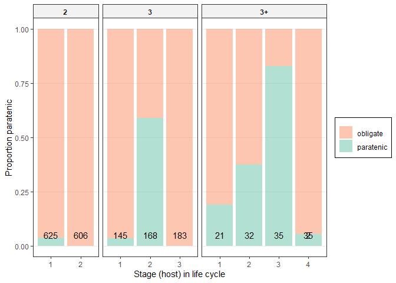<!-- -->

Let’s get rid of definitive hosts in the plot, since by definition they
are not paratenic hosts. This makes the pattern a bit clearer.

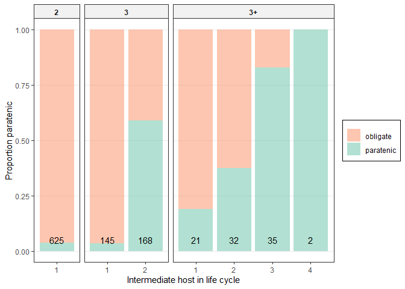<!-- -->

The pattern also looks like it occurs in every worm group, though the
magnitude varies. For example, paratenic second hosts in 3-host cycles
are more common in acanths and nematodes than cestodes.

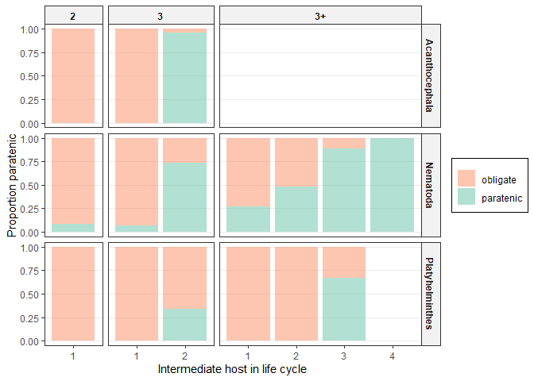<!-- -->

There are so few life cycles with fourth intermediate hosts (2), we
should probably drop them to avoid complete separation in the models
below.

Do obligate and paratenic hosts differ in size? Yes, since paratenic
hosts are later in the life cycle they tend to be larger than obligate
intermediate hosts.

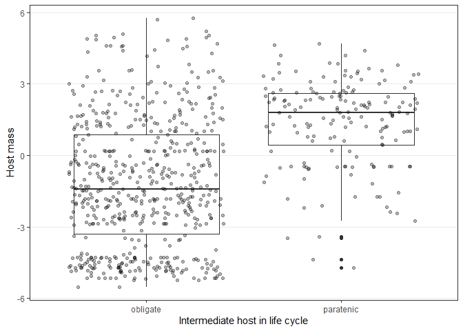<!-- -->

However, within a life cycle stage, there is not much difference between
obligate and paratenic hosts.

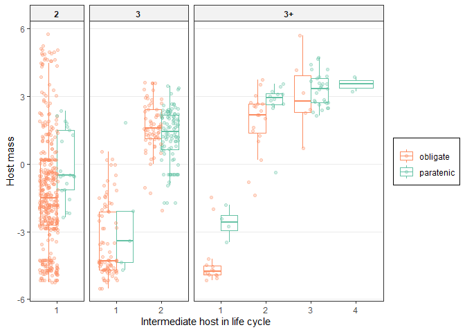<!-- -->

There might be a slight tendency for worms to enter their paratenic
hosts at a larger body size though.

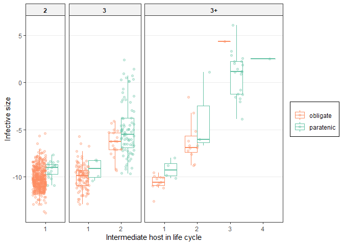<!-- -->

This looks robust across helminth groups…

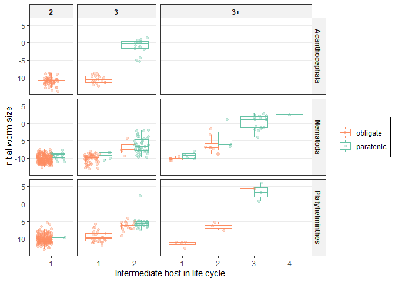<!-- --> We
can also bin by initial worm size and see that paratenesis becomes more
likely as worm larvae get bigger. The largest larvae treat their next
intermediate host almost always as paratenic.

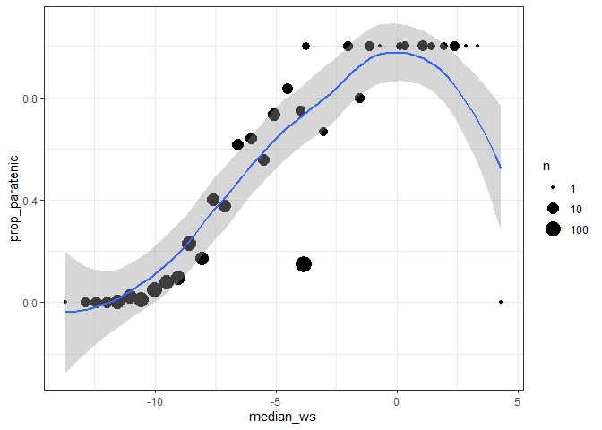<!-- -->

However, when we break the data up by life cycle stage, we see that much
of the correlation between paratenesis and worm size is driven by stage.

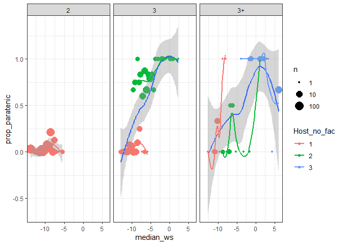<!-- -->

## General linear models

Now we can test a few models. We first fit general linear models
(binomial errors) that do not account for parasite relatedness. We start
by adding life cycle characteristics to the model: host number in life
cycle and life cycle length.

Both host number and life cycle length are significant predictors of
paratenesis, as expected.

| Resid. Df | Resid. Dev | Df | Deviance | Pr(\>Chi) |
| --------: | ---------: | -: | -------: | --------: |
|      1025 |   927.7635 | NA |       NA |        NA |
|      1023 |   574.8756 |  2 | 352.8878 |         0 |

| Resid. Df | Resid. Dev | Df | Deviance | Pr(\>Chi) |
| --------: | ---------: | -: | -------: | --------: |
|      1025 |   927.7635 | NA |       NA |        NA |
|      1023 |   716.9895 |  2 |  210.774 |         0 |

The effect of life cycle length, though, is mainly due to having more
hosts. When we added life cycle length to a model with host number, it
was not significant. However, the opposite, adding host number to the
life cycle length-only model was a clear improvement.

| Resid. Df | Resid. Dev | Df | Deviance | Pr(\>Chi) |
| --------: | ---------: | -: | -------: | --------: |
|      1023 |   574.8756 | NA |       NA |        NA |
|      1021 |   572.8055 |  2 | 2.070142 | 0.3552011 |

| Resid. Df | Resid. Dev | Df | Deviance | Pr(\>Chi) |
| --------: | ---------: | -: | -------: | --------: |
|      1023 |   716.9895 | NA |       NA |        NA |
|      1021 |   572.8055 |  2 |  144.184 |         0 |

The interaction between host number and life cycle length was
significant, but the effect size was small.

| Resid. Df | Resid. Dev | Df | Deviance | Pr(\>Chi) |
| --------: | ---------: | -: | -------: | --------: |
|      1021 |   572.8055 | NA |       NA |        NA |
|      1020 |   562.9173 |  1 | 9.888173 | 0.0016634 |

For example, first hosts in 4-host cycles are more likely to be
paratenic than those in 2-host cycles.

    ## 
    ## Call:
    ## glm(formula = is_paratenic_dummy ~ stage_lcl, family = "binomial", 
    ##     data = filter(dat, lcl_max_fac != "1", Def.int != "Definitive", 
    ##         Host_no_fac != "4"))
    ## 
    ## Deviance Residuals: 
    ##     Min       1Q   Median       3Q      Max  
    ## -1.8781  -0.2738  -0.2738  -0.2649   2.5951  
    ## 
    ## Coefficients:
    ##                 Estimate Std. Error z value Pr(>|z|)    
    ## (Intercept)     -3.26476    0.21246 -15.366  < 2e-16 ***
    ## stage_lcllc3_1  -0.06744    0.50228  -0.134  0.89319    
    ## stage_lcllc3_2   3.62578    0.26407  13.730  < 2e-16 ***
    ## stage_lcllc3+_1  1.81784    0.59495   3.055  0.00225 ** 
    ## stage_lcllc3+_2  2.75394    0.42246   6.519 7.09e-11 ***
    ## stage_lcllc3+_3  4.84030    0.49627   9.753  < 2e-16 ***
    ## ---
    ## Signif. codes:  0 '***' 0.001 '**' 0.01 '*' 0.05 '.' 0.1 ' ' 1
    ## 
    ## (Dispersion parameter for binomial family taken to be 1)
    ## 
    ##     Null deviance: 927.76  on 1025  degrees of freedom
    ## Residual deviance: 562.92  on 1020  degrees of freedom
    ## AIC: 574.92
    ## 
    ## Number of Fisher Scoring iterations: 6

Does adding host size to the model improve things? This is a smaller
sample size, since not all stages had available host sizes. After
accounting for life cycle stage, the addition of host size is marginally
significant. The further addition of a stage by host size interaction is
also mildly significant.

| Resid. Df | Resid. Dev | Df |  Deviance | Pr(\>Chi) |
| --------: | ---------: | -: | --------: | --------: |
|       735 |   511.9098 | NA |        NA |        NA |
|       734 |   508.6887 |  1 |  3.221127 | 0.0726936 |
|       729 |   492.1976 |  5 | 16.491017 | 0.0055734 |

The parameter for host size suggests paratenesis is more likely in
larger hosts, which is what I would expect.

    ## 
    ## Call:
    ## glm(formula = is_paratenic_dummy ~ stage_lcl + host_bm, family = "binomial", 
    ##     data = filter(dat, lcl_max_fac != "1", Def.int != "Definitive", 
    ##         Host_no_fac != "4", !is.na(host_bm)))
    ## 
    ## Deviance Residuals: 
    ##     Min       1Q   Median       3Q      Max  
    ## -2.0086  -0.3643  -0.3089  -0.2572   2.5057  
    ## 
    ## Coefficients:
    ##                 Estimate Std. Error z value Pr(>|z|)    
    ## (Intercept)     -2.80886    0.22683 -12.383  < 2e-16 ***
    ## stage_lcllc3_1   0.35738    0.54137   0.660  0.50916    
    ## stage_lcllc3_2   3.04492    0.30323  10.042  < 2e-16 ***
    ## stage_lcllc3+_1  2.02864    0.65129   3.115  0.00184 ** 
    ## stage_lcllc3+_2  2.08166    0.46880   4.440 8.98e-06 ***
    ## stage_lcllc3+_3  3.99464    0.55808   7.158 8.20e-13 ***
    ## host_bm          0.12092    0.06664   1.815  0.06958 .  
    ## ---
    ## Signif. codes:  0 '***' 0.001 '**' 0.01 '*' 0.05 '.' 0.1 ' ' 1
    ## 
    ## (Dispersion parameter for binomial family taken to be 1)
    ## 
    ##     Null deviance: 790.83  on 740  degrees of freedom
    ## Residual deviance: 508.69  on 734  degrees of freedom
    ## AIC: 522.69
    ## 
    ## Number of Fisher Scoring iterations: 5

Here is how host size impacts paratenesis.

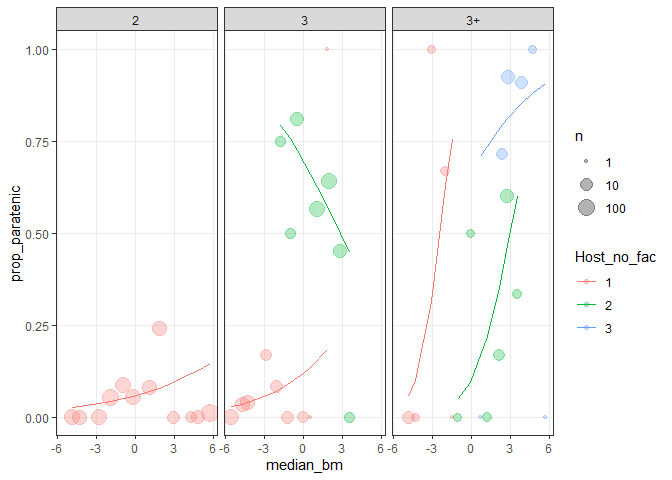<!-- -->

Let’s fit the same model, but with starting parasite size. Larger worms
have less incentive to grow, so may be more likely to undergo
paratenesis. Adding starting size improves the model with just life
stage, while adding the interaction between parasite size and stage is a
mild improvement.

| Resid. Df | Resid. Dev | Df | Deviance | Pr(\>Chi) |
| --------: | ---------: | -: | -------: | --------: |
|       727 |   330.6459 | NA |       NA |        NA |
|       726 |   313.9723 |  1 | 16.67357 | 0.0000444 |
|       721 |   300.7613 |  5 | 13.21097 | 0.0214800 |

At a given stage, larger worms are more likely to undergo paratenesis.

    ## 
    ## Call:
    ## glm(formula = is_paratenic_dummy ~ stage_lcl + log_start, family = "binomial", 
    ##     data = filter(dat, lcl_max_fac != "1", Def.int != "Definitive", 
    ##         Host_no_fac != "4", !is.na(initial_biov)))
    ## 
    ## Deviance Residuals: 
    ##     Min       1Q   Median       3Q      Max  
    ## -3.0030  -0.3093  -0.2546  -0.2096   2.6726  
    ## 
    ## Coefficients:
    ##                 Estimate Std. Error z value Pr(>|z|)    
    ## (Intercept)      0.37779    0.95043   0.397 0.691001    
    ## stage_lcllc3_1  -0.17958    0.56419  -0.318 0.750267    
    ## stage_lcllc3_2   3.18752    0.46835   6.806    1e-11 ***
    ## stage_lcllc3+_1  2.25408    0.63770   3.535 0.000408 ***
    ## stage_lcllc3+_2  0.18066    0.89167   0.203 0.839437    
    ## stage_lcllc3+_3  2.57188    1.37037   1.877 0.060548 .  
    ## log_start        0.35930    0.09543   3.765 0.000167 ***
    ## ---
    ## Signif. codes:  0 '***' 0.001 '**' 0.01 '*' 0.05 '.' 0.1 ' ' 1
    ## 
    ## (Dispersion parameter for binomial family taken to be 1)
    ## 
    ##     Null deviance: 685.14  on 732  degrees of freedom
    ## Residual deviance: 313.97  on 726  degrees of freedom
    ## AIC: 327.97
    ## 
    ## Number of Fisher Scoring iterations: 6

Here are the model predictions plotted.

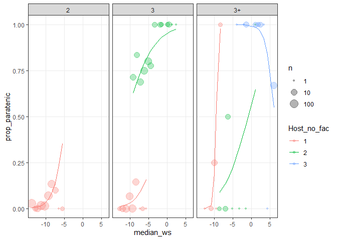<!-- -->

We can also fit these models with both host mass and worm size together.
There is still an effect of worm size but not host mass and there is not
a clear interaction.

| Resid. Df | Resid. Dev | Df |  Deviance | Pr(\>Chi) |
| --------: | ---------: | -: | --------: | --------: |
|       524 |   303.2064 | NA |        NA |        NA |
|       522 |   283.4054 |  2 | 19.801003 | 0.0000501 |
|       521 |   279.9040 |  1 |  3.501396 | 0.0613171 |

Even with fewer data, the effect of worm size on paratenesis is
significant and of about the same magnitude.

    ## 
    ## Call:
    ## glm(formula = is_paratenic_dummy ~ stage_lcl + host_bm + log_start, 
    ##     family = "binomial", data = filter(dat, lcl_max_fac != "1", 
    ##         Def.int != "Definitive", Host_no_fac != "4", !is.na(initial_biov), 
    ##         !is.na(host_bm)))
    ## 
    ## Deviance Residuals: 
    ##     Min       1Q   Median       3Q      Max  
    ## -3.0894  -0.3729  -0.2907  -0.1784   2.5993  
    ## 
    ## Coefficients:
    ##                 Estimate Std. Error z value Pr(>|z|)    
    ## (Intercept)      1.03079    1.02003   1.011 0.312233    
    ## stage_lcllc3_1   0.33139    0.60546   0.547 0.584152    
    ## stage_lcllc3_2   2.50038    0.51309   4.873  1.1e-06 ***
    ## stage_lcllc3+_1  2.50553    0.71177   3.520 0.000431 ***
    ## stage_lcllc3+_2 -0.74859    0.95177  -0.787 0.431560    
    ## stage_lcllc3+_3  1.37794    1.45272   0.949 0.342864    
    ## host_bm          0.18327    0.08144   2.250 0.024426 *  
    ## log_start        0.36940    0.10189   3.626 0.000288 ***
    ## ---
    ## Signif. codes:  0 '***' 0.001 '**' 0.01 '*' 0.05 '.' 0.1 ' ' 1
    ## 
    ## (Dispersion parameter for binomial family taken to be 1)
    ## 
    ##     Null deviance: 588.26  on 529  degrees of freedom
    ## Residual deviance: 283.41  on 522  degrees of freedom
    ## AIC: 299.41
    ## 
    ## Number of Fisher Scoring iterations: 6

## Generalized Linear Mixed Models

We have not accounted for parasite taxonomy yet. A common problem in
taxonomic binomial models is that some taxa at a given life stage will
be either always paratenic or always obligate. This is called complete
separation and causes unrealistic parameter estimates. So let’s fit
taxonomic mixed models, but only include the higher taxonomic levels
(from order level), because higher taxonomic groups are likely to
include a mix of obligate and paratenic stages (no complete separation;
adding family results in complete separation).

We fit the same series of models, but no include taxonomic effects.

Both host number and life cycle length are significant predictors of
paratenesis, as before.

|       | npar |      AIC |      BIC |     logLik | deviance |    Chisq | Df | Pr(\>Chisq) |
| :---- | ---: | -------: | -------: | ---------: | -------: | -------: | -: | ----------: |
| mmod0 |    4 | 863.8262 | 883.5599 | \-427.9131 | 855.8262 |       NA | NA |          NA |
| mmod1 |    6 | 524.6963 | 554.2968 | \-256.3481 | 512.6963 | 343.1299 |  2 |           0 |

|         | npar |      AIC |      BIC |     logLik | deviance |    Chisq | Df | Pr(\>Chisq) |
| :------ | ---: | -------: | -------: | ---------: | -------: | -------: | -: | ----------: |
| mmod0   |    4 | 863.8262 | 883.5599 | \-427.9131 | 855.8262 |       NA | NA |          NA |
| mmod1.1 |    6 | 691.4055 | 721.0060 | \-339.7028 | 679.4055 | 176.4207 |  2 |           0 |

The effect of life cycle length, though, is mainly due to having more
hosts. When we added life cycle length to a model with host number, it
was marginally significant. However, the opposite, adding host number to
the life cycle length-only model was a clear improvement.

|       | npar |      AIC |      BIC |     logLik | deviance |    Chisq | Df | Pr(\>Chisq) |
| :---- | ---: | -------: | -------: | ---------: | -------: | -------: | -: | ----------: |
| mmod1 |    6 | 524.6963 | 554.2968 | \-256.3481 | 512.6963 |       NA | NA |          NA |
| mmod2 |    8 | 521.2192 | 560.6866 | \-252.6096 | 505.2192 | 7.477091 |  2 |   0.0237887 |

|         | npar |      AIC |      BIC |     logLik | deviance |    Chisq | Df | Pr(\>Chisq) |
| :------ | ---: | -------: | -------: | ---------: | -------: | -------: | -: | ----------: |
| mmod1.1 |    6 | 691.4055 | 721.0060 | \-339.7028 | 679.4055 |       NA | NA |          NA |
| mmod2   |    8 | 521.2192 | 560.6866 | \-252.6096 | 505.2192 | 174.1863 |  2 |           0 |

The interaction between host number and life cycle length was
significant too, but the effect size was small.

|       | npar |      AIC |      BIC |     logLik | deviance |    Chisq | Df | Pr(\>Chisq) |
| :---- | ---: | -------: | -------: | ---------: | -------: | -------: | -: | ----------: |
| mmod2 |    8 | 521.2192 | 560.6866 | \-252.6096 | 505.2192 |       NA | NA |          NA |
| mmod3 |    9 | 507.8621 | 552.2629 | \-244.9310 | 489.8621 | 15.35712 |  1 |     8.9e-05 |

If we look at the model with life stage (combo of host number and life
cycle length), we see that the random effects are not zero, suggesting
taxa differ in the likelihood of paratenesis. They are also not
enormous, which would indicate complete separation. The fixed effect of
“fourth intermediate host” though is huge, because these are always
categorized as paratenic. This is an indication of complete separation.

    ## Generalized linear mixed model fit by maximum likelihood (Laplace
    ##   Approximation) [glmerMod]
    ##  Family: binomial  ( logit )
    ## Formula: is_paratenic_dummy ~ (1 | parasite_phylum) + (1 | parasite_class) +  
    ##     (1 | parasite_order) + stage_lcl
    ##    Data: 
    ## filter(dat, lcl_max_fac != "1", Def.int != "Definitive", Host_no_fac !=  
    ##     "4")
    ## 
    ##      AIC      BIC   logLik deviance df.resid 
    ##    507.9    552.3   -244.9    489.9     1017 
    ## 
    ## Scaled residuals: 
    ##     Min      1Q  Median      3Q     Max 
    ## -5.3493 -0.2088 -0.1676 -0.0846 11.8202 
    ## 
    ## Random effects:
    ##  Groups          Name        Variance  Std.Dev. 
    ##  parasite_order  (Intercept) 5.533e-01 0.7438162
    ##  parasite_class  (Intercept) 2.936e-07 0.0005418
    ##  parasite_phylum (Intercept) 1.468e+00 1.2117238
    ## Number of obs: 1026, groups:  
    ## parasite_order, 30; parasite_class, 6; parasite_phylum, 3
    ## 
    ## Fixed effects:
    ##                 Estimate Std. Error z value Pr(>|z|)    
    ## (Intercept)      -3.6825     0.7780  -4.734 2.21e-06 ***
    ## stage_lcllc3_1   -0.1916     0.5115  -0.375   0.7079    
    ## stage_lcllc3_2    4.3554     0.3349  13.004  < 2e-16 ***
    ## stage_lcllc3+_1   1.6003     0.6545   2.445   0.0145 *  
    ## stage_lcllc3+_2   2.3774     0.4902   4.850 1.24e-06 ***
    ## stage_lcllc3+_3   5.4355     0.6538   8.314  < 2e-16 ***
    ## ---
    ## Signif. codes:  0 '***' 0.001 '**' 0.01 '*' 0.05 '.' 0.1 ' ' 1
    ## 
    ## Correlation of Fixed Effects:
    ##             (Intr) st_3_1 st_3_2 s_3+_1 s_3+_2
    ## stg_lcll3_1 -0.127                            
    ## stg_lcll3_2 -0.270  0.295                     
    ## stg_lcl3+_1 -0.099  0.144  0.229              
    ## stg_lcl3+_2 -0.124  0.190  0.293  0.229       
    ## stg_lcl3+_3 -0.161  0.151  0.369  0.165  0.216

The model’s R2 suggests the random effects (taxonomy) account for a fair
chunk of the residual variation.

    ##                   R2m       R2c
    ## theoretical 0.3898626 0.6220828
    ## delta       0.2828942 0.4513990

Does adding host size to the model improve things? After accounting for
life cycle stage, the addition of host size is not significant, but the
host size by stage interaction is significant.

|           | npar |      AIC |      BIC |     logLik | deviance |     Chisq | Df | Pr(\>Chisq) |
| :-------- | ---: | -------: | -------: | ---------: | -------: | --------: | -: | ----------: |
| mmod3\_bm |    9 | 465.1121 | 506.5841 | \-223.5561 | 447.1121 |        NA | NA |          NA |
| mmod4\_bm |   10 | 465.6869 | 511.7669 | \-222.8435 | 445.6869 |  1.425192 |  1 |   0.2325508 |
| mmod5\_bm |   15 | 450.7005 | 519.8205 | \-210.3503 | 420.7005 | 24.986401 |  5 |   0.0001402 |

The host size variable explains maybe 2% of the variation not accounted
for by stage, with the interaction accounting for maybe 4% more.

    ## [[1]]
    ##                   R2m       R2c
    ## theoretical 0.3949189 0.6092815
    ## delta       0.3280615 0.5061338
    ## 
    ## [[2]]
    ##                   R2m       R2c
    ## theoretical 0.3993941 0.6158536
    ## delta       0.3327265 0.5130542
    ## 
    ## [[3]]
    ##                   R2m       R2c
    ## theoretical 0.4420917 0.6535181
    ## delta       0.3744249 0.5534903

Let’s fit the same model, but with starting parasite size. Larger worms
have less incentive to grow, so may be more likely to undergo
paratenesis. Adding starting size improves the model with just life
stage but the interaction does not.

|           | npar |      AIC |      BIC |     logLik | deviance |     Chisq | Df | Pr(\>Chisq) |
| :-------- | ---: | -------: | -------: | ---------: | -------: | --------: | -: | ----------: |
| mmod3\_w0 |    9 | 264.7633 | 306.1376 | \-123.3817 | 246.7633 |        NA | NA |          NA |
| mmod4\_w0 |   10 | 251.3333 | 297.3047 | \-115.6666 | 231.3333 | 15.430036 |  1 |   0.0000856 |
| mmod5\_w0 |   15 | 257.5682 | 326.5254 | \-113.7841 | 227.5682 |  3.765041 |  5 |   0.5837153 |

At a given stage, larger worms are more likely to undergo paratenesis.

    ## Generalized linear mixed model fit by maximum likelihood (Laplace
    ##   Approximation) [glmerMod]
    ##  Family: binomial  ( logit )
    ## Formula: is_paratenic_dummy ~ (1 | parasite_phylum) + (1 | parasite_class) +  
    ##     (1 | parasite_order) + stage_lcl + log_start
    ##    Data: 
    ## filter(dat, lcl_max_fac != "1", Def.int != "Definitive", Host_no_fac !=  
    ##     "4", !is.na(initial_biov))
    ## 
    ##      AIC      BIC   logLik deviance df.resid 
    ##    251.3    297.3   -115.7    231.3      723 
    ## 
    ## Scaled residuals: 
    ##     Min      1Q  Median      3Q     Max 
    ## -8.3423 -0.0990 -0.0571 -0.0290 20.3682 
    ## 
    ## Random effects:
    ##  Groups          Name        Variance  Std.Dev.
    ##  parasite_order  (Intercept) 3.064e+00 1.750490
    ##  parasite_class  (Intercept) 1.962e-06 0.001401
    ##  parasite_phylum (Intercept) 3.946e+00 1.986347
    ## Number of obs: 733, groups:  
    ## parasite_order, 27; parasite_class, 6; parasite_phylum, 3
    ## 
    ## Fixed effects:
    ##                 Estimate Std. Error z value Pr(>|z|)    
    ## (Intercept)      -0.1474     1.8082  -0.082 0.935029    
    ## stage_lcllc3_1    0.2424     0.6409   0.378 0.705249    
    ## stage_lcllc3_2    5.3865     0.8105   6.646 3.02e-11 ***
    ## stage_lcllc3+_1   2.4687     0.9792   2.521 0.011693 *  
    ## stage_lcllc3+_2  -0.3504     1.1290  -0.310 0.756255    
    ## stage_lcllc3+_3   3.9770     2.0151   1.974 0.048428 *  
    ## log_start         0.5315     0.1552   3.424 0.000616 ***
    ## ---
    ## Signif. codes:  0 '***' 0.001 '**' 0.01 '*' 0.05 '.' 0.1 ' ' 1
    ## 
    ## Correlation of Fixed Effects:
    ##             (Intr) st_3_1 st_3_2 s_3+_1 s_3+_2 s_3+_3
    ## stg_lcll3_1 -0.062                                   
    ## stg_lcll3_2 -0.497  0.203                            
    ## stg_lcl3+_1  0.047  0.156  0.097                     
    ## stg_lcl3+_2 -0.310  0.105  0.274  0.111              
    ## stg_lcl3+_3 -0.543  0.071  0.579 -0.012  0.307       
    ## log_start    0.682  0.049 -0.420  0.172 -0.369 -0.632

Worm size explains just a few percent of the variation within stages.

    ## [[1]]
    ##                   R2m       R2c
    ## theoretical 0.4780501 0.8090673
    ## delta       0.4054103 0.6861293
    ## 
    ## [[2]]
    ##                   R2m       R2c
    ## theoretical 0.4949090 0.8386662
    ## delta       0.4298325 0.7283885

We can also fit these models with both host mass and worm size together.
There is still an effect of worm size but not host mass and there is not
a clear interaction.

|               | npar |      AIC |      BIC |     logLik | deviance |     Chisq | Df | Pr(\>Chisq) |
| :------------ | ---: | -------: | -------: | ---------: | -------: | --------: | -: | ----------: |
| mmod3\_bm\_w0 |    9 | 249.7098 | 288.1657 | \-115.8549 | 231.7098 |        NA | NA |          NA |
| mmod4\_bm\_w0 |   11 | 240.8597 | 287.8614 | \-109.4299 | 218.8597 | 12.850100 |  2 |   0.0016205 |
| mmod5\_bm\_w0 |   12 | 240.4045 | 291.6791 | \-108.2023 | 216.4045 |  2.455185 |  1 |   0.1171373 |

Even with fewer data, the effect of worm size on paratenesis is
significant and of about the same magnitude.

    ## Generalized linear mixed model fit by maximum likelihood (Laplace
    ##   Approximation) [glmerMod]
    ##  Family: binomial  ( logit )
    ## Formula: is_paratenic_dummy ~ (1 | parasite_phylum) + (1 | parasite_class) +  
    ##     (1 | parasite_order) + stage_lcl + host_bm + log_start +  
    ##     host_bm:log_start
    ##    Data: 
    ## filter(dat, lcl_max_fac != "1", Def.int != "Definitive", Host_no_fac !=  
    ##     "4", !is.na(initial_biov), !is.na(host_bm))
    ## 
    ##      AIC      BIC   logLik deviance df.resid 
    ##    240.4    291.7   -108.2    216.4      518 
    ## 
    ## Scaled residuals: 
    ##     Min      1Q  Median      3Q     Max 
    ## -8.0782 -0.1469 -0.0543 -0.0141 19.4499 
    ## 
    ## Random effects:
    ##  Groups          Name        Variance  Std.Dev.
    ##  parasite_order  (Intercept) 2.248e+00 1.499437
    ##  parasite_class  (Intercept) 6.535e-05 0.008084
    ##  parasite_phylum (Intercept) 3.727e+00 1.930513
    ## Number of obs: 530, groups:  
    ## parasite_order, 23; parasite_class, 6; parasite_phylum, 3
    ## 
    ## Fixed effects:
    ##                   Estimate Std. Error z value Pr(>|z|)    
    ## (Intercept)        0.94077    1.85615   0.507 0.612267    
    ## stage_lcllc3_1     0.32795    0.70397   0.466 0.641314    
    ## stage_lcllc3_2     5.15926    0.88811   5.809 6.28e-09 ***
    ## stage_lcllc3+_1    2.99173    1.17949   2.536 0.011198 *  
    ## stage_lcllc3+_2   -0.44581    1.10945  -0.402 0.687813    
    ## stage_lcllc3+_3    5.72173    2.36711   2.417 0.015642 *  
    ## host_bm           -0.72547    0.42314  -1.714 0.086438 .  
    ## log_start          0.57795    0.15996   3.613 0.000303 ***
    ## host_bm:log_start -0.07743    0.04896  -1.582 0.113757    
    ## ---
    ## Signif. codes:  0 '***' 0.001 '**' 0.01 '*' 0.05 '.' 0.1 ' ' 1
    ## 
    ## Correlation of Fixed Effects:
    ##             (Intr) st_3_1 st_3_2 s_3+_1 s_3+_2 s_3+_3 hst_bm lg_str
    ## stg_lcll3_1  0.009                                                 
    ## stg_lcll3_2 -0.422  0.033                                          
    ## stg_lcl3+_1  0.158  0.267 -0.003                                   
    ## stg_lcl3+_2 -0.313  0.083  0.266  0.066                            
    ## stg_lcl3+_3 -0.262  0.028  0.509  0.046  0.252                     
    ## host_bm     -0.364 -0.010 -0.048 -0.169  0.052 -0.465              
    ## log_start    0.707  0.069 -0.267  0.277 -0.362 -0.267 -0.441       
    ## hst_bm:lg_s -0.401 -0.114  0.103 -0.270  0.072 -0.401  0.950 -0.441
    ## convergence code: 0
    ## Model failed to converge with max|grad| = 0.14111 (tol = 0.002, component 1)

I like to use a Bayesian approach to put CIs on the plots, so let’s
refit the worm size models with MCMCglmm.

refit model with worm size

    ## 
    ##  Iterations = 3001:502001
    ##  Thinning interval  = 1000
    ##  Sample size  = 500 
    ## 
    ##  DIC: 222.1867 
    ## 
    ##  G-structure:  ~parasite_order
    ## 
    ##                post.mean l-95% CI u-95% CI eff.samp
    ## parasite_order     5.295   0.7539    11.02    413.4
    ## 
    ##                ~parasite_class
    ## 
    ##                post.mean  l-95% CI u-95% CI eff.samp
    ## parasite_class     2.105 0.0004469    11.17      500
    ## 
    ##                ~parasite_phylum
    ## 
    ##                 post.mean  l-95% CI u-95% CI eff.samp
    ## parasite_phylum     50.85 0.0006636    98.13      235
    ## 
    ##  R-structure:  ~units
    ## 
    ##       post.mean l-95% CI u-95% CI eff.samp
    ## units         1        1        1        0
    ## 
    ##  Location effects: is_paratenic_dummy ~ stage_lcl + log_start 
    ## 
    ##                 post.mean l-95% CI u-95% CI eff.samp  pMCMC   
    ## (Intercept)       -0.1744  -6.9521   4.8765    430.4  0.976   
    ## stage_lcllc3_1     0.1561  -1.6079   1.5263    500.0  0.816   
    ## stage_lcllc3_2     6.2052   4.5648   8.0797    338.0 <0.002 **
    ## stage_lcllc3+_1    2.8584   0.5819   5.0709    500.0  0.020 * 
    ## stage_lcllc3+_2   -0.5583  -2.9720   2.2685    500.0  0.684   
    ## stage_lcllc3+_3    4.7954   0.6243   9.3901    679.0  0.032 * 
    ## log_start          0.6456   0.3223   0.9772    500.0 <0.002 **
    ## ---
    ## Signif. codes:  0 '***' 0.001 '**' 0.01 '*' 0.05 '.' 0.1 ' ' 1

Here are the predicted values with CIs. The predictions are from a model
without a stage x size interaction.

These predictions are from a model with a stage x size interaction.

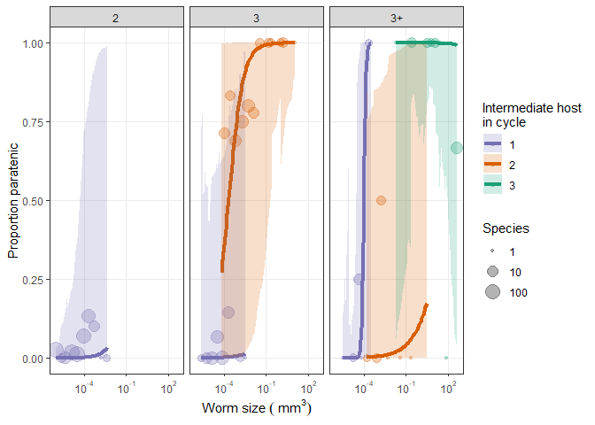<!-- -->

Those look overfit to me and the DIC is indeed higher (worse) in the
more complex model.

    ## [1] 222.1867

    ## [1] 226.2067

# Conclusions

Paratenic hosts are more common at later life cycle stages. Moreover, at
a given life stage (e.g. second intermediate host), paratenic hosts are
more common if worms enter the host as large larvae. Thus, the luxury of
flexible life cycles may only be possible with some larval growth.
